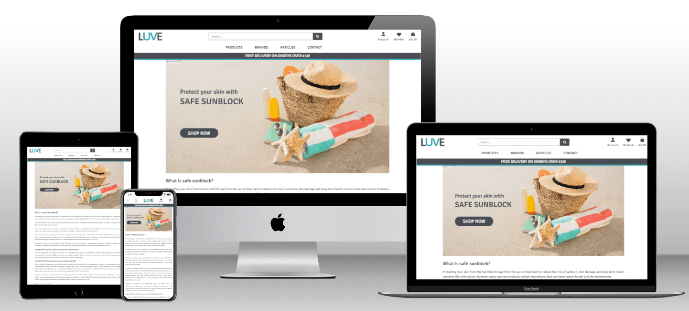

# LUVE

LUVE is a full-stack web application built with Django. It is a B2C e-commerce store for safe sunblocks. The site is targeted towards anyone who is interested in safe sunblocks for their skin and the environment.

Users can search for products with a keyword, filter by a product category or a brand, or browse through the range of safe sunblocks and purchase them from the site. Registered users have the ability to add items to their wishlist, like articles, save their details to the profile, and view their order history. They also have the full CRUD functionality to post, edit and delete product reviews within the site. 

For the business owner or staff, the full CRUD functionality is available to add, edit and delete products and articles without having to access the admin panel. 

The application implements user authenticaion to provide role-based access to its centrally-owned dataset, and user authorisation to allow users to manipulate the data based on their permission. 

The application also provides the admin dashbord where the site admin has the full CRUD functionality to manage all the contents for the site.

The payments are processed using Stripe. In order to test the payment process, the following card details were used. 

  

Click here to view [LUVE](https://luve.herokuapp.com/) (CTRL + Click to open in a new browser tab).  

  

# UXD - User Experience Design

## User Stories

Based on the concept of an online B2C store, the following 10 Epics were created for the application's features. These epics were then further developed into 60 User Stories. 54 of these were implemented, 4 remainig open for future development, and 2 were not implemented.

### EPIC: User Account & Profile  

* As a Site User, I can easily register and receive an email confirmation after registering so that I can verify that registration was successful and confirm my email address.  

* As a Site User, I can easily log into my account so that I can access my personal account information.  

* As a Site User, I can recover my password in case I forget it so that recover access to my account.  

* As a Site User, I can log out of my account so that I can keep my account secure.  

* As a Site User, I can create an account so that I don't have to enter my details every time I place an order.  

* As a Site User, I can create a personalised user profile so that I can view my order history and confirmation.  

* As a Site User, I can view my user profile so that I can review the details stored on my account.  

* As a Site User, I can edit my user profile so that I can keep my information up to date.  

### EPIC: Site Navigation  

* As a Site User, I can edit my user profile so that I can keep my information up to date.  

* As a Site User, I can navigate the site intuitively so that I can easily find what I am looking for.  

*  As a Site User, I can browse a list of products so that I can select a product to view.  

* As a Shopper, I can select a product from the list so that I can view the full details of a product.  

* As a Shopper, I can search for a product by name or description so that I can find a specific product quickly.  

* As a Shopper, I can view a specific category or type of products so that I can easily browse the category or type of products I'm looking for.  

* As a Shopper, I can sort the list of available products so that I can easily view a list of products based on the sorting option selected.  

* As a Site User, I can see a message confirming my action so that I am notified when my action was successfully executed.  

* As a Site User, I can see a custom error message when an HTTP error occurs so that I can understand why the error has occurred and easily navigate back to the site.  

### EPIC: Site Admin  

* As a Site Admin I can create, update and delete the contents of the site so that I can manage the contents of the site.

### EPIC: Product Management  

* As a Business Owner/Staff, I can add a product to the site so that I can add new items to sell.  

* As a Business Owner/Staff, I can update product details so that I can change product prices, descriptions, images and other details.  

* As a Business Owner/Staff, I can delete a product so that I can remove the product which is no longer for sale.  

* As a Business Owner/Staff, I can see error messages when submitting the product form so that I can understand how the errors can be resolved.  

### EPIC: Purchasing & Checkout  

* As a Shopper, I can add a product to my shopping bag so that I may decide to purchase the item later.  

* As a Shopper, I can view items in my shopping bag so that I can identify the total cost of my purchases and verify the items to be purchased.  

* As a Shopper, I can edit the shopping bag so that I can make changes to the contents of my bag before checkout.  

* As a Shopper, I can see how much more I need to spend to get free delivery so that I can take advantage of the free shipping offered.  

* As a Shopper, I can easily view the total of my purchases at any time so that I can keep track of what I'm spending.  

* As a Shopper, I can pay for my order with a card so that I can complete my order and receive it from the business.  

* As a Shopper, I can checkout as a guest so that I don't have to register an account to place an order.  

* As a Shopper, I can view an order confirmation after checkout so that I know that my order was placed successfully and I can verify what I have purchased.  

* As a Shopper, I can have my details auto-filled at checkout so that I can place an order quickly and easily.  

* As a Shopper, I can receive an email confirmation once my order is placed so that I can keep the confirmation of what I have purchased for my records.  

* As a Shopper, I can see error messages when submitting the checkout form so that I can understand how the errors can be resolved.  

* As a Shopper, I can sign up for the newsletter so that I can receive updates from the business.  

### EPIC: Wishlist  

* As a Shopper, I can save products to my wishlist so that I can easily find them in future to purchase.  
 
* As a Shopper, I can view the products in my wishlist so that I can easily find them to purchase them in future.  

* As a Shopper, I can remove products from my wishlist so that I can maintain my wishlist.  

### EPIC: Product Review  

* As a Shopper, I can view the reviews posted by others so that I can see the feedback from others which may help my purchasing decision.   

* As a Shopper, I can post a product review so that I can share my feedback for the product with others.  

* As a Shopper, I can edit the product review I posted so that make changes to my review.  

* As a Shopper, I can delete the product review I posted so that I can remove it from the product details page.  

### EPIC: Customer Queries  

* As a Site User, I can submit a query via the site so that I can easily ask questions to the business.  

* As a Business Owner/Staff, I can receive an email when a query is posted via the contact form so that I can respond to their query in a timely manner.  

* As a Site User, I can see error messages when submitting the contact form so that I can understand how the errors can be resolved.  

### EPIC: Article Posts

* As a Business Owner/Staff, I can post an article so that I can provide relevant and useful information to customers.  

*  As a Business Owner/Staff, I can edit a blog article so that I can make changes to the article as required.  

* As a Business Owner/Staff, I can delete a blog article so that I can remove the article from the site.  

* As a Site User, I can see error messages when submitting article form so that I can understand how the errors can be resolved.  

### EPIC: Business Admin  

*  As a Business Owner, I can easily email special deals and updates to customers so that I can promote the business.  

* As a Business Owner/Staff, I can have a Facebook page to share special deals and updates so that I can promote the business.  

* As a Business Owner, I can include a privacy policy in the site so that we are compliant with GDPR requirements.  

* As a Business Owner, I can provide terms & conditions so that I can inform the customers of the rules and regulations for the use of the site.  

* As a Developer, I include a site map so that it improves the search engine ranking and potential customers can find the site when they search online.  

* As a Developer, I include robots.txt so that it defines where search engines are not allowed to go within the site.  

### User Stories Not Implemented

The following User Stories were not implemented for EPIC: Customer Queries. The decision was made not to create a Customer Queries page as I felt it would be easier for the business owner to manage customer queries in their email inbox, rather than having to manage them both in their inbox and the dashboard within the site. The queries posted using the contact form are emailed to the business owner and they can respond to the customers directly from their inbox and keep track of all the email correspondence.   

* As a Business Owner/Staff, I can **view customer queries posted via the contact form within the site ** so that I can keep track of queries from customers.

* As a Business Owner/Staff, I can delete customer queries received from the customer queries page so that I can keep the database clean.

### User Stories for Future Development 

The following User Stories were not implemented. Please see the details in the Features Left to Implement section.

* As a Site User, I can delete my user profile so that I can remove my personal information from the site.

* As a Business owner/staff, I can edit delivery charge and free delivery threshold so that I can update them as required.

* As a Business Owner/Staff, I can easily add a new brand to the store so that I can broaden the range of products that we offer.

* As a Business Owner/Staff, I can respond to a product review posted by a shopper so that I can provide clarification or feedback where appropriate.

## Agile Methodology

This application was developed using agile methodology. [LUVE Kanban Board](https://github.com/users/ShizukaDonaghue/projects/12/) was created using GitHub Projects and was used to manage the entire development process. 

The 10 Epics listed for the application's features above were included as Milestones in the Kanban Board. A GitHub issue was created for each User Story using my own User Story templates. Each User Story contained detailed acceptance criteria and they were broken down into tasks necessary to satisfy those acceptance criteria.

MoSCoW Prioritisation technique was applied to each User Story and each User Story was labelled based on their prioritisation level as follows:

* Must Have - Guaranteed to be delivered
* Should Have - Add significant value but not vital
* Could Have - Have a small impact if left out
* Won't Have - Not a priority for this iteration

The User Stories were prioritised based on their prioritisation levels and tracked through the Kanban Board until they were executed fully.

The Kanban Board also contained 10 other Epics, which were not related to the application's features. These were included so that the entire project was tracked and managed through the Kanban Board.

* EPIC: Project Setup
* EPIC: Testing
* EPIC: README

## Wireframes

Wireframes were created using [Balsamiq](https://balsamiq.com/) to visualise the structure of the site. 
The structure of the finished product is slightly different from the wireframes, 
but this is due to the design choices made during the development process. 

## Database Design
An Entity Relationship Diagram was created using [Figma](https://www.figma.com/) to visualise the relationships between the data structures. 

The intention was to utilise Django-AllAuth for the user authentication system and create other custom models. 

## Security Features and Defensive Design

### User Authentication
Django-AllAuth is used to authenticate users. Certain pages within the application can only be accessed by users who are logged in. These pages are secured with Django's @login_required decorator, which provides role-based access to the central dataset within the application.
If a user tries to access these pages without having logged in, they are directed to the Login page instead.

### User Authorisation
Users can only edit or delete their own records in the application. If a user tries to edit or delete other users' records, an error message is displayed to the user explaining the issue. This forbidden error prevents the user from editing or deleting the record.

### Form Validation
Django's built-in form validation is used to validate the forms within the application. The forms will not submit unless they are completed correctly. If there are errors, error messages are displayed to assist users to fill in all the fields correctly.

In addition to Django's built-in form validation, [jQuery Validation Plugin](https://jqueryvalidation.org/) has been added to the Article form, Contact form, and Product form. This displays a custom error message explaining the error for each field to assist users to fill in the field correctly.

Since Django's build-in form validation does not catch empty strings in the Summernote fields used in the Article form, additional form validation measure was added in validators.py to strip white space and raise an error message if the field is left empty. 

As for the Checkout form, regular expression is built into the form to validate the fields as jQuery validation caused issues with Stripe payment process, which is documented under issue [#92](https://github.com/ShizukaDonaghue/luve/issues/92).

With these measures combined, all the forms within the site are fully validated for each submission.

### Security-Sensitive Information
Environment variables are stored in env.py for local development to ensure security-sensitive information is not pushed to the GitHub repository. For the production environment, these variables are added to Config Vars for the application in Heroku. 

## Design

### Colour Scheme
The design of the site is intended to be simple and clean so as not to distract users from colourful images of products. [Coolors](https://coolors.co) was used to create the colour pallet.

* #FFFFFF White is used for the background colour.
* #474D53 Outer Space is used for the main text colour to ensure a good contrast against the background colour.
* #DDF8FC Light Cyan is used as the background colour for the order summary section in the Shopping Bag page.  
* #17A2B8 Moonstone is used as an accent colour throughout the site and also for the hover effect on buttons.
* #F56B8E Bright Pink is used for the Wishlist related objects.

The logo for the site was created using the same colour palette to be consistent. 

### Typography
The font used throughout the site is Signika which is imported from [Google Fonts](https://fonts.google.com/). Sans-serif is the backup font in case the main font is not available.

# Features
## Existing Features
### Browser Tabs

## Search Engine Optimisation (SEO) & Web Marketing

### Keywords

Keyword research was performed using Google search results and [Wordtracker](https://www.wordtracker.com/). A mixture of short tail and long tail keywords were considered based on their relevance, authority and volume, aiming to identify keywords that are high enough volumes and low enough competition. 

During the research, it was found that the word "sunscreen" and "sunblock" were used interchangeably (although they are technically different based on their purpose) and that the volume of searches was much higher for the word "sunscreen." Therefore, both words have been included in the keywords which have been added to the site's keywords and description sections in the head element. 

  
Wordtracker results for "safe sunscreen"

  
  

  
Wordtracker results for "safe sunblock"

  
  

### Sitemap XXXXXXXXXXXXXXXXXXXXXXXXXXXXXXXXX ADD DETAILS HERE XXXXXXXXXXXXX

### Robots   XXXXXXXXXXXXXXXXXXXXXXXXXXXXXXXXX ADD DETAILS HERE XXXXXXXXXXXXX

### Content Marketing

In order to consistently create useful, engating content that will attract, engage and convert the target makert into customers, the business owner and staff can post articles relevant to the site. These articals intend to provide useful and meaningful information on safe sunblock, which in turn helps to build trust and loyalty as well as positioning the business as a reliable source of information.

### Social Media Marketing

### Features Left to Implement

EPIC: User Acount & Profile:
* As a Site User, I can delete my user profile so that I can remove my personal information from the site.

EPIC: Business Admin:
* As a Business owner/staff, I can edit delivery charge and free delivery threshold so that I can update them as required.

EPIC: Product Management:
* As a Business Owner/Staff, I can easily add a new brand to the store so that I can broaden the range of products that we offer.

EPIC: Product Review:
* As a Business Owner/Staff, I can respond to a product review posted by a shopper so that I can provide clarification or feedback where appropriate.

### Credit

* Solution for the issue [#84](https://github.com/ShizukaDonaghue/luve/issues/84) related to product reviews deletion was from [Stackoverflow](https://stackoverflow.com/questions/70346755/django-deleting-using-modal-show-and-delete-only-the-first-item-from-the-tabl)

* Solution for the issue [#86](https://github.com/ShizukaDonaghue/luve/issues/86) related to jQuery validation for the checkout form was from [Stackoverflow](https://stackoverflow.com/questions/47332825/jquery-functions-not-firing-with-stripe-elements).

* Solution for the issue [#92](https://github.com/ShizukaDonaghue/luve/issues/92) related to the checkout form was found in [PP5-Fresh-Nest](https://github.com/AliOKeeffe/PP5-Fresh-Nest/blob/main/checkout/forms.py) repository.