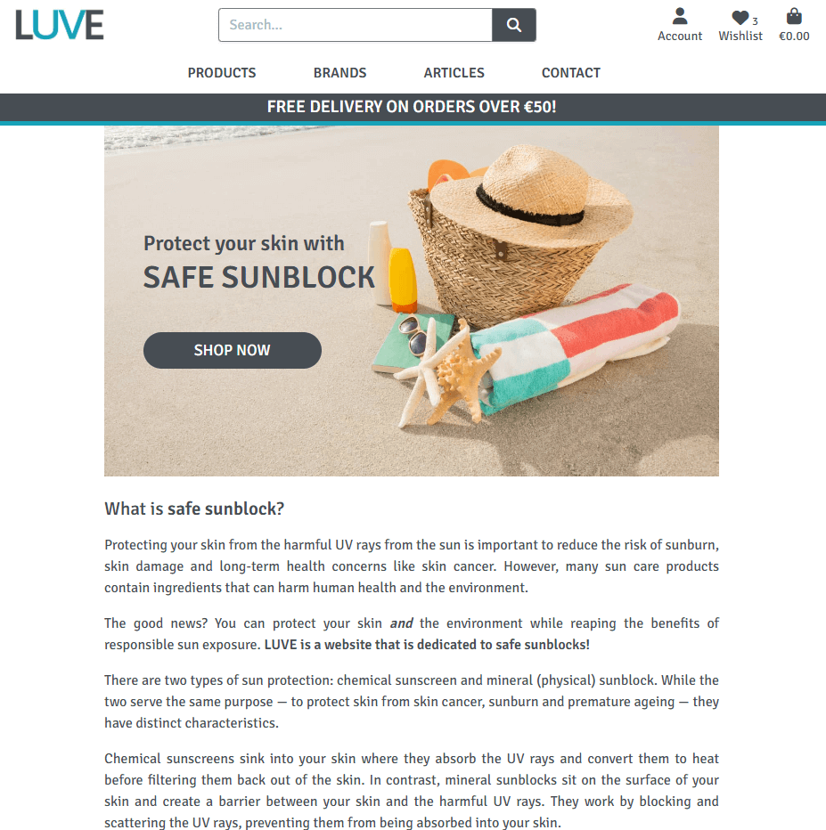
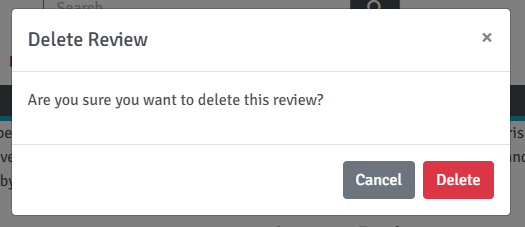
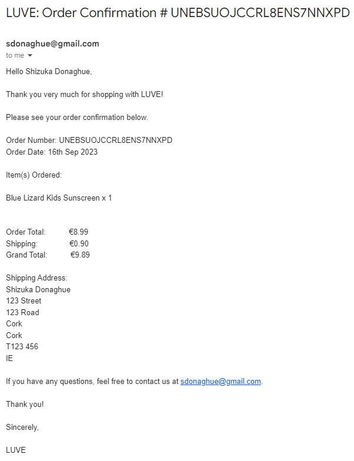
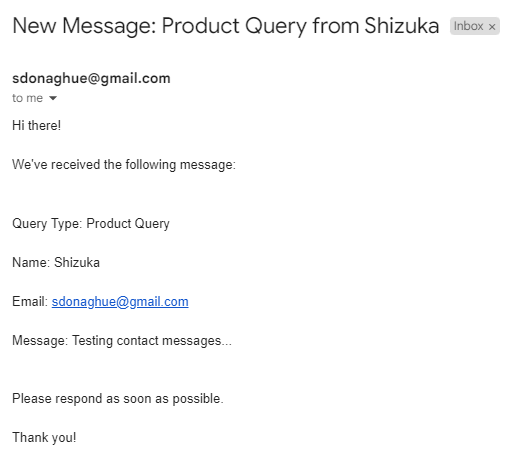

# LUVE

LUVE is a full-stack web application built with Django. It is a B2C e-commerce store for safe sunblocks. The site is targeted towards anyone who is interested in safe sunblocks for their skin and the environment.

Users can search for products with a keyword, filter by a product category or a brand, or browse through the range of safe sunblocks and purchase them from the site. Registered users have the ability to add items to their wishlist, like articles, save their details to the profile, and view their order history. They also have the full CRUD functionality to post, edit and delete product reviews within the site. 

For the business owner or staff, the full CRUD functionality is available to add, edit and delete products and articles without having to access the admin panel. 

The application implements user authenticaion to provide role-based access to its centrally-owned dataset, and user authorisation to allow users to manipulate the data based on their permission. 

The application also provides the admin dashbord where the site admin has the full CRUD functionality to manage all the contents for the site.

Click here to view [LUVE](https://luve.herokuapp.com/) (CTRL + Click to open in a new browser tab).  

  

# UXD - User Experience Design

## User Stories

Based on the concept of an online B2C store, the following 10 Epics were created for the application's features. These epics were then further developed into 60 User Stories. 54 of these were implemented, 4 remainig open for future development, and 2 were not implemented.

### EPIC: User Account & Profile  

* As a Site User, I can easily register and receive an email confirmation after registering so that I can verify that registration was successful and confirm my email address.  

* As a Site User, I can easily log into my account so that I can access my personal account information.  

* As a Site User, I can recover my password in case I forget it so that recover access to my account.  

* As a Site User, I can log out of my account so that I can keep my account secure.  

* As a Site User, I can create an account so that I don't have to enter my details every time I place an order.  

* As a Site User, I can create a personalised user profile so that I can view my order history and confirmation.  

* As a Site User, I can view my user profile so that I can review the details stored on my account.  

* As a Site User, I can edit my user profile so that I can keep my information up to date.  

### EPIC: Site Navigation  

* As a Site User, I can edit my user profile so that I can keep my information up to date.  

* As a Site User, I can navigate the site intuitively so that I can easily find what I am looking for.  

*  As a Site User, I can browse a list of products so that I can select a product to view.  

* As a Shopper, I can select a product from the list so that I can view the full details of a product.  

* As a Shopper, I can search for a product by name or description so that I can find a specific product quickly.  

* As a Shopper, I can view a specific category or type of products so that I can easily browse the category or type of products I'm looking for.  

* As a Shopper, I can sort the list of available products so that I can easily view a list of products based on the sorting option selected.  

* As a Site User, I can see a message confirming my action so that I am notified when my action was successfully executed.  

* As a Site User, I can see a custom error message when an HTTP error occurs so that I can understand why the error has occurred and easily navigate back to the site.  

### EPIC: Site Admin  

* As a Site Admin I can create, update and delete the contents of the site so that I can manage the contents of the site.

### EPIC: Product Management  

* As a Business Owner/Staff, I can add a product to the site so that I can add new items to sell.  

* As a Business Owner/Staff, I can update product details so that I can change product prices, descriptions, images and other details.  

* As a Business Owner/Staff, I can delete a product so that I can remove the product which is no longer for sale.  

* As a Business Owner/Staff, I can see error messages when submitting the product form so that I can understand how the errors can be resolved.  

### EPIC: Purchasing & Checkout  

* As a Shopper, I can add a product to my shopping bag so that I may decide to purchase the item later.  

* As a Shopper, I can view items in my shopping bag so that I can identify the total cost of my purchases and verify the items to be purchased.  

* As a Shopper, I can edit the shopping bag so that I can make changes to the contents of my bag before checkout.  

* As a Shopper, I can see how much more I need to spend to get free delivery so that I can take advantage of the free shipping offered.  

* As a Shopper, I can easily view the total of my purchases at any time so that I can keep track of what I'm spending.  

* As a Shopper, I can pay for my order with a card so that I can complete my order and receive it from the business.  

* As a Shopper, I can checkout as a guest so that I don't have to register an account to place an order.  

* As a Shopper, I can have my details auto filled at checkout so that I can place an order quickly and easily.  

* As a Shopper, I can view an order confirmation after checkout so that I know that my order was placed successfully and I can verify what I have purchased.  

* As a Shopper, I can receive an email confirmation once my order is placed so that I can keep the confirmation of what I have purchased for my records.  

* As a Shopper, I can see error messages when submitting the checkout form so that I can understand how the errors can be resolved.  

* As a Shopper, I can sign up for the newsletter so that I can receive updates from the business.  

### EPIC: Wishlist  

* As a Shopper, I can save products to my wishlist so that I can easily find them in future to purchase.  
 
* As a Shopper, I can view the products in my wishlist so that I can easily find them to purchase them in future.  

* As a Shopper, I can remove products from my wishlist so that I can maintain my wishlist.  

### EPIC: Product Review  

* As a Shopper, I can view the reviews posted by others so that I can see the feedback from others which may help my purchasing decision.   

* As a Shopper, I can post a product review so that I can share my feedback for the product with others.  

* As a Shopper, I can edit the product review I posted so that make changes to my review.  

* As a Shopper, I can delete the product review I posted so that I can remove it from the product details page.  

### EPIC: Customer Queries  

* As a Site User, I can submit a query via the site so that I can easily ask questions to the business.  

* As a Business Owner/Staff, I can receive an email when a query is posted via the contact form so that I can respond to their query in a timely manner.  

* As a Site User, I can see error messages when submitting the contact form so that I can understand how the errors can be resolved.  

### EPIC: Article Posts

* As a Business Owner/Staff, I can post an article so that I can provide relevant and useful information to customers.  

*  As a Business Owner/Staff, I can edit a blog article so that I can make changes to the article as required.  

* As a Business Owner/Staff, I can delete a blog article so that I can remove the article from the site.  

* As a Site User, I can see error messages when submitting article form so that I can understand how the errors can be resolved.  

### EPIC: Business Admin  

*  As a Business Owner, I can easily email special deals and updates to customers so that I can promote the business.  

* As a Business Owner/Staff, I can have a Facebook page to share special deals and updates so that I can promote the business.  

* As a Business Owner, I can include a privacy policy in the site so that we are compliant with GDPR requirements.  

* As a Business Owner, I can provide terms & conditions so that I can inform the customers of the rules and regulations for the use of the site.  

* As a Developer, I include a site map so that it improves the search engine ranking and potential customers can find the site when they search online.  

* As a Developer, I include robots.txt so that it defines where search engines are not allowed to go within the site.  

### User Stories Not Implemented

The following User Stories were not implemented for EPIC: Customer Queries. The decision was made not to create a Customer Queries page as I felt it would be easier for the business owner to manage customer queries in their email inbox, rather than having to manage them both in their inbox and the dashboard within the site. The queries posted using the contact form are emailed to the business owner and they can respond to the customers directly from their inbox and keep track of all the email correspondence.   

* As a Business Owner/Staff, I can view customer queries posted via the contact form within the site so that I can keep track of queries from customers.

* As a Business Owner/Staff, I can delete customer queries received from the customer queries page so that I can keep the database clean.

### User Stories for Future Development 

The following User Stories were not implemented. Please see the details in the Features Left to Implement section.

* As a Business Owner/Staff, I can easily add a new brand to the store so that I can broaden the range of products that we offer.

* As a Business owner/staff, I can edit delivery charge and free delivery threshold so that I can update them as required.

* As a Business Owner/Staff, I can respond to a product review posted by a shopper so that I can provide clarification or feedback where appropriate.

* As a Site User, I can delete my user profile so that I can remove my personal information from the site.

## Agile Methodology

This application was developed using agile methodology. [LUVE Kanban Board](https://github.com/users/ShizukaDonaghue/projects/12/) was created using GitHub Projects and was used to manage the entire development process. 


The 10 Epics listed for the application's features above were included as Milestones in the Kanban Board. A GitHub issue was created for each User Story using my own User Story templates. Each User Story contained detailed acceptance criteria and they were broken down into tasks necessary to satisfy those acceptance criteria.

MoSCoW Prioritisation technique was applied to each User Story and each User Story was labelled based on their prioritisation level as follows:

* Must Have - Guaranteed to be delivered
* Should Have - Add significant value but not vital
* Could Have - Have a small impact if left out
* Won't Have - Not a priority for this iteration

The User Stories were prioritised based on their prioritisation levels and tracked through the Kanban Board until they were executed fully.

The Kanban Board also contained 10 other Epics, which were not related to the application's features. These were included so that the entire project was tracked and managed through the Kanban Board.

* EPIC: Project Setup
* EPIC: Testing
* EPIC: README

## Wireframes

Wireframes were created using [Balsamiq](https://balsamiq.com/) to visualise the structure of the site. 
The structure of the finished product is slightly different from the wireframes, 
but this is due to the design choices made during the development process. 


## Database Design
An Entity Relationship Diagram was created using [Figma](https://www.figma.com/) to visualise the relationships between the data structures. 

The intention was to utilise Django-AllAuth for the user authentication system and create other custom models. 


## Security Features and Defensive Design

### User Authentication
Django-AllAuth is used to authenticate users. Certain pages within the application can only be accessed by users who are logged in. These pages are secured with Django's @login_required decorator, which provides role-based access to the central dataset within the application.
If a user tries to access these pages without having logged in, they are directed to the Log-in page instead.

### User Authorisation
Users can only edit or delete their own records in the application. If a user tries to edit or delete other users' records, an error message is displayed to the user explaining the issue. A custom 403 error page is also available which explains the error and contains a link to the store so that users can easily navigate back.

### Form Validation
Django's built-in form validation is used to validate the forms within the application. The forms will not submit unless they are completed correctly. If there are errors, error messages are displayed to notify the user of the errors.

In addition to Django's built-in form validation, [jQuery Validation Plugin](https://jqueryvalidation.org/) has been added to the Article form, Contact form, and Product form. This displays a custom error message explaining the error for each field to assist users to fill in the field correctly.

Since Django's build-in form validation does not catch empty strings in the Summernote fields used in the Article form, additional form validation measure was added in validators.py to strip white space and raise an error message if the field is left empty. 

As for the Checkout form, regular expression is built into the form to validate the fields as jQuery validation caused issues with Stripe payment process, which is documented under issue [#92](https://github.com/ShizukaDonaghue/luve/issues/92).

With these measures combined, all the forms within the site are fully validated for each submission.

### Security-Sensitive Information
Environment variables are stored in env.py for local development to ensure security-sensitive information is not pushed to the GitHub repository. For the production environment, these variables are added to Config Vars for the application in Heroku. 

## Design

### Colour Scheme
The design of the site is intended to be simple and clean so as not to distract users from colourful images of products. [Coolors](https://coolors.co) was used to create the colour pallet.

* #FFFFFF White is used for the background colour.
* #474D53 Outer Space is used for the main text colour to ensure a good contrast against the background colour.
* #DDF8FC Light Cyan is used as the background colour for the order summary section in the Shopping Bag page.  
* #17A2B8 Moonstone is used as an accent colour throughout the site and also for the hover effect on buttons.
* #F56B8E Bright Pink is used for the Wishlist related objects.

The logo for the site was created using the same colour palette to be consistent. 


### Typography
The font used throughout the site is Signika which is imported from [Google Fonts](https://fonts.google.com/). Sans-serif is the backup font in case the main font is not available.


# Marketing Strategy

## Search Engine Optimisation (SEO)

### Keywords

Keyword research was performed using Google search results and [Wordtracker](https://www.wordtracker.com/). A mixture of short tail and long tail keywords were considered based on their relevance, authority and volume, aiming to identify keywords that are high enough volumes and low enough competition. 

During the research, it was found that the word "sunscreen" and "sunblock" were used interchangeably (although they are technically different based on their purpose) and that the volume of searches was much higher for the word "sunscreen." Therefore, both words have been included in the keywords which have been added to the site's keywords and description sections in the head element. 

<details>
  <summary>Wordtracker results for "safe sunscreen"</summary>
  
  

</details>

<details>
  <summary>Wordtracker results for "safe sunblock"</summary>
  
  

</details>

### Sitemap 

A sitemap was generated using [XML-Sitemaps](https://www.xml-sitemaps.com/) to list the site's important page urls, ensuring that search engines can find and crawl through them easily. This helps the search engines to understand the site's structure. [sitemap.xml](https://github.com/ShizukaDonaghue/luve/blob/main/sitemap.xml) has been added to the repository.

### Robots 

robots.txt has been created to control which pages within the site are accessed by search engines. This has also been added to the repository. 


## Content Marketing

In order to consistently create useful and helpful content that will attract and convert the target makert into customers, the business can post articles relevant to the site. These articals intend to provide useful and meaningful information on safe sunblock, which in turn helps to build trust and loyalty as well as positioning the business as a reliable source of information.

## Social Media Marketing

A Facebook Business page has been created to promote the business. The business owner and staff can post relevant and useful information here to help increase their reach with a minimal marketing cost. They can share information about their special offers and sales which may help to convert the potential customers into actual sales.


## Email Marketing

[Mailchimp](https://mailchimp.com/) was used to set up the newsletter sign-up form embedded in the footer. Users just need their email address to sign up and the business can use this mailing list to share information about their business to existing and potential customers directly, including special offers and sales. 


# Features

## Existing Features

### Browser Tabs
The browser tab contains LUVE's favicon and the title of the page to clearly indicate which page is open. The favicon was generated from the logo using [RealFaviconGenerator](https://realfavicongenerator.net/). 


### Logo
The logo was created using [Wix](https://www.wix.com/). The logo on the navigation bar functions as a link back to the Home page for ease of navigation.  


### Navigation Bar
The navbar is fixed at the top of every page and includes links to other pages.  

  

This section contains the search bar in which the user can enter a keyword to search products by their name or description so that they can find what they are looking for quickly.

The Wishlist icon displays the number of items in the wishlist, and the Shopping Bag icons displays the total value of items currently in the bag. These are available on all pages so that users can keep track of their spend while they shop.

The delivery banner is also fixed under the navbar displaying the remaining order value to qualify for free shipping. 

### Footer
The footer contains the newsletter sign-up form so that users can receive updates from the business and the business can use the newsletter to promote their store. 

This section also includes the privacy policy and terms & condition. The social media icons are available here so users can easily access the business's social media accounts. Clicking on any of these icons opens a new browser tab so that users will still have LUVE open to navigate back easily.


### Sign Up Page


The Sign-up link is available from the Account menu in the navbar for users who are not logged in already. Users can enter their details here to register with the site. When the form is submitted, they will receive an email with a link to confirm their email address. Once the email address is confirmed, a success message is displayed to notify the user, and the user is redirected to the Home page.

### Log In Page


The Log-in link is available from the Account menu in the navbar for users who are not logged in already. Returning users can enter their details here to log in to avail of all the features.
Once logged in, a success message is displayed to notify the user, and the user is redirected to the Home page.

This page contains a link to reset password. Users can reset their password from here if required. Once they complete the form, they will receive an email with a link to reset their password. 

### Log Out Page


The Log-out link is available from the Account menu in the navbar for users who are logged in already. Users can log out from here by clicking on the "Log Out" button. Once logged out, a success message is displayed to confirm that the user has logged out, and the user is redirected to the Home page.

### Home Page



The Home page introduces the site and its purpose. This page also includes "Shop Now" button so that the user can easily navigate to the store to purchase safe sunblocks and also "Article" button so that they can read more about the risks and impact of sunscreens.

### Products Page

  

Users can browse a list of products in the Products page. They have the option to choose a product category from the Product menu or choose a brand from the Brand menu to narrow down their search. They can also select a sorting option from the dropdown menu to sort the products in a specific order.

The "Add to Bag" is available for each product so that users can easily add products to their shopping bag. Once product are added to their bag, the user is notified and the total order value is displayed under the Bag icon in the navbar.

Users can also add products to their wishlist by clicking on the pink outline heart. Once added, the user is notified and the love heart is coloured in pink. They can also remove the product from their wishlist by clicking on the pink heart as it toggles between "add" and "remove" for their wishlist.

For users with superuser or staff permission, the links for Edit Product and Delet Products are displayed on the product cards. The business owner and staff can easily access these options from here. 

### Product Details Page

  

Users can access the Product Details page by clicking on the product image or the product name in the Products page as well as the Wishlist page. This page displays the product information, contains the quantity selector and the buttons to "Add to Bag" or "Continue Shopping" to return to the Products page. 

Users can select the quantity of the products to add to their shopping bag. If the total order quantity of a product exceeds the maximum order quantity of 20, the user is notified of the error. Otherwise, products are added to the bag, and the total order value is displayed under the Bag icon in the navbar. 

The Wishlist heart is available here also to toggle between "add" and "remove" for their wishlist. The number of items in the wishlist is displayed by the Wishlist heart in the navbar.

For users with superuser or staff permission, the links for Edit Product and Delet Products are displayed on the product image. The business owner and staff can easily access these options from here. 

Under the Product Details section on this page, users can view product reviews posted by other users. If the user is logged in, the product review form is available to post a review and/or rate the product. Once the form is submitted, the user is notified and the review is added to the site in ascending order. 

  

If the user is the author of the review, the vertical ellipsis is available next to the posting date. The "edit" button navigates the user to Edit Review page, and the "delete" button triggers a model to confirm the deletion. 

### Edit Review Page

   

When the "edit" button is selected from the vertical ellipsis, the user is navigated to the Edit Review page where they can make changes to the review they have posted. Once the changes are submitted, the review is updated and the user is notified. 

### Delete Review Modal

When the "delete" button is selected from the vertical ellipsis, a modal is displayed to confirm the deletion. Once confirmed, the review is deleted and the user is notified.

 

### Add Product Page

   

The Product Management link is available from the Account menu for users with superuser or staff permission. The business owner and staff can add a product to the site from here by completing the Product form. Once the form is completed, the product is added and the user is notified.  

### Edit Product Page

 

The link to update the product details is available on the Products page as well as the Product Details page for users with superuser or staff permission. When the link is selected, they are directed to the Edit Product form where they can update the details. Once the complete form is submitted, the product is updated and the user is notified.

### Delete Product Modal

The link to delete a product is available on the Products page as well as the Product Details page for users with superuser or staff permission. When the link is selected, a modal appears to confirm the deletion. Once confirmed, the product is deleted and the user is notified.

  

### Wishlist Page

 

Users can access the Wishlist page from the love heart icon in the navbar. The Wishlist page lists the items in their wishlist. Users can easily add items to the shopping bag using the "Add to Bag" button. They can also remove the items from the wishlist by clicking on the "X" on the product card. 

### Shopping Bag Page

  

Users can access the Shopping Bag page from the bag icon in the navbar. The Shopping Bag page lists the items in the bag as well as the quantity selector. Users can adjust the quantity of the products or remove them from the bag on this page. If the total order quantity of a product exceeds the maximum order quantity of 20, the user is notified of the error. Otherwise, the order quantity is adjusted and the total order value is updated on the page and under the Bag icon in the navbar. 

If there is a shipping fee, the fee is displayed in the order summary section. The remaining order value to qualify for free shipping is also displayed here. 

Users can either use the "Continue Shopping" button to return to the store, or select the "Secure Checkout" button to complete their order. 

### Checkout Page

  

Users can place the order by completing the checkout form. If the user details are saved in the profile, the details are populated from the database. Alternatively, if the user is logged in and placing an order, they can save their details to the profile by selecting the "Save this information to my profile" box. 

This page contains the order summary so that users can verify what the items they are purchasing and the total cost before submitting their order.

Once the checkout form is completed correctly, the payment is processed by Stripe. A webhook is also triggered and payment and other events are notified by Stripe.  

In order to test the payment process, the following card details were used. 

  

### Checkout Success Page

  

Once the checkout is processed, the user is navigated to the Checkout Success page. This page displays the order confirmation. 

An email confirmation is also sent to the user, confirming the order.  

   


### My Profile Page

 

If the user is logged in, My Profile link is availabe from the Accout menu in the navbar. This is where the user can save their details for a faster checkout process. Alternatively, if the user is logged in and placing an order, the tick box is available in the checkout form to save the delivery details into their profile. They can also update their details here if they are already saved.  

This page also displays their order history. Orders placed by the user are listed in descending order based on the order dates. This include the link to the order confirmation if they would like to check the details. 

### Articles Page 

   

Users can view articles posted by the business from the Articles menu in the navbar. This is where the business can post relevant and useful information for users that may help to promote their business. 

The number of likes for each article is displayed on the article card here.

For users with superuser or staff permission, the links for Edit Article and Delet Article are displayed on the product cards. The business owner and staff can easily access these options from here. 

### Article Details Page

  

Users can access the Article Details page by selecting the article card on the Articles page. This page displays the article contents as well as the number of likes for the article. If the user is logged in, the icon functions as a button to toggle between "like" and "unlike" the article. 

### Add Article Page

   

The link to Article Management is available from the Account menu to users with superuser or staff permission. The business owner or staff can add articles by completing the tihs form. Once the form is submitted, the article is added and the user is notified.

### Edit Article Page

   

The link to update the article details is available on the Articles page as well as the Article Details page for users with superuser or staff permission. When the link is selected, they are directed to the Edit Article form where they can edit the details. Once the complete form is submitted, the article is updated and the user is notified.

### Delete Article Modal

The link to delete a product is available on the Articles page as well as the Article Details page for users with superuser or staff permission. When the link is selected, a modal appears to confirm the deletion. Once confirmed, the article is deleted and the user is notified.

   

### Contact Page

 

Users can submit a query using the contact form within the site. Once the form is submitted, they are navigated to the Contact Success page. 

### Contact Success Page

 

The Contact Success page confirms that a query has been received from the user. 

An email confirmation is also sent to the user, notifying that their message has been received. 

  

Another email is sent to the business to notify them of the new message. This email includes the message and contact details of the customer, so they can respond to the customer directly from their inbox.  

  

### Error Pages

 

Custom HTML pages have been created for HTTP 400, 403, 404 and 500 errors. Each error page contains a link to the Products page so that users can easily navigate back to the site.

## Features Left to Implement

The following features are from the 4 x User Stories which are yet to be implemented. 

### Brand Name Entry 

Currently, a new brand name can only be added from the admin panel. It would be essential for the business to have this functionality without having to access the admin panel so that they can easily broden the range of products they offer. This is from User Story [#91](https://github.com/ShizukaDonaghue/luve/issues/91).

### Delivery Fee Updates

The free delivery threshold and the delivery fee are both coded in settings.py and therefore, if any changes are to be made, the codes will need to be updated. It would be beneficial for the business to be able to update the threshold and the fee on a front end panel without having to update the codes or accessing the admin panel. This is from User Story [#72](https://github.com/ShizukaDonaghue/luve/issues/72).

### Product Review Response

It would be a nice feature if the business could respond to product reviews posted by users so that they can provide clarification or feedback where appropriate. This is from User Story [#40](https://github.com/ShizukaDonaghue/luve/issues/40).

### User Profile Deletion

An option for users to be able to delete their own profile would be a good addtion so that users can remove their personal information from the site. This would also clean up the database for easier maintenance. This is from User Story [#52](https://github.com/ShizukaDonaghue/luve/issues/52).


# Technologies Used

## Languages
* [HTML](https://html.spec.whatwg.org/) was used to create the content and structure for the application.
* [CSS](https://www.w3.org/Style/CSS/Overview.en.html) was used to add styling to the application.
* [Python](https://www.python.org/) was used to add functionality to the application.
* [JavaScript](https://en.wikipedia.org/wiki/JavaScript) was used to create interactive content for the application.

## Frameworks, Libraries and Tools Used within the Application
* [Django](https://www.djangoproject.com/) was used as the main Python framework for the application.
* [Django-AllAuth](https://django-allauth.readthedocs.io/en/latest/overview.html) was used to create accounts and authenticate users.
* [Django Crispy Forms](https://django-crispy-forms.readthedocs.io/en/latest/) was used for the forms within the site.
* [Bootstrap](https://getbootstrap.com/) was used for general layout and styling for the application.
* [jQuery](https://jquery.com/) was used to close the hamburger menu.
* [jQuery Validation Plugin](https://jqueryvalidation.org/) was used to validate the forms used in the site and raise error messages where necessary.
* [ElephantSQL](https://www.elephantsql.com/) was used for the Production database.
* [Cloudinary](https://cloudinary.com/) was used to store all static files and images.
* [Summernote](https://summernote.org/) editor was used on the Add Article form.
* [Git](https://git-scm.com/) was used for version control and tracked changes in the codes.
* [GitHub](https://github.com/) was used to store the repository and the codes.
* [Gitpod](https://www.gitpod.io/) was used to create, edit and preview the codes during the development.
* [Heroku](https://id.heroku.com/login) was used to deploy the application.
* [Google Fonts](https://fonts.google.com/) was used for the Signika font.
* [Font Awesome](https://fontawesome.com/) was used for all the icons.
* [XML-Sitemaps](https://www.xml-sitemaps.com/) was used to generate sitemap.xml
* [Mailchimp](https://mailchimp.com/) was used for the newsletter signup form.
* [Wix](https://www.wix.com/) was used to design the logo.
* [RealFaviconGenerator](https://realfavicongenerator.net/) was used to generate the favicon.

## Other Online Tools used
* [Balsamiq](https://balsamiq.com/) was used to generate wireframes for the application.
* [Figma](https://www.figma.com/) was used to generate the database schema.
* [Chrome Dev Tools](https://developer.chrome.com/docs/devtools/) were used extensively while adjusting the objects in the site for different screen sizes.
* [Coolors](https://coolors.co) was used to generate the colour palette.
* [Remove Background](https://www.remove.bg/) was used to remove the background from the favicon.
* [Multi Device Website Mockup Generator](https://techsini.com/multi-mockup/index.php) was used to generate the mockup image showing the application on various screen sizes.
* [Compressor.io](https://compressor.io/) was used to compress the images used in the application and README.
* [Grammarly](https://app.grammarly.com/) was used to remove grammatical and typographical errors in the application, README.md and TESTING.md files.
* [Wordtracker](https://www.wordtracker.com) was used for the keyword searches.

## Validators
* [W3C HTML Validator](https://validator.w3.org/) was used to validate HTML codes.
* [W3C CSS Validator](https://jigsaw.w3.org/css-validator/) was used to validate CSS codes.
* [JSHint](https://jshint.com/) was used to validate JavaScript codes.
* [CI Python Linter](https://pep8ci.herokuapp.com/) was used to validate Python codes.

# Testing
For the full details of the testing executed, please see [TESTING.md](https://github.com/ShizukaDonaghue/luve/blob/main/TESTING.md).


# Deployment
The live deployed application - [Happy Beans](https://happy-beans.herokuapp.com/) (CTRL + Click to open in a new browser tab).

### Deployment - Heroku
The following are the steps to deploy the application on Heroku.

1. Create a repository in GitHub using [Code Institute template](https://github.com/Code-Institute-Org/gitpod-full-template)
2. Open GitPod from the newly created repository
3. Install Django and supporting libraries:
	* In the terminal, enter `pip3 install 'django<4' gunicorn`
	* In the terminal, enter `pip3 install dj_database_url==0.5.0 psycopg2`
	* In the terminal, enter `pip3 install dj3-cloudinary-storage`
4. Create requirements.txt
	* In the terminal, enter `pip3 freeze --local > requirements.txt`
5. Create a Django project
	* In the terminal, enter `django-admin startproject 'project_name' .` (enter the project name without the quotation marks, a space and a full stop)
6. Create an app
	* In the terminal, enter `python3 manage.py startapp 'app_name'` (enter the app name without the quotation marks)
7. Add the newly created app into settings.py
	* Add the app name into the INSTALLED_APPS array and save the file

		```python
		INSTALLED_APPS =[
			...
			...
			'app_name'
		]
		```

8. Migrate the Changes
	* In the terminal, enter `python3 manage.py migrate`
9. Run the server to verify that the basic skelton project is now up and running
	* In the terminal, enter `python3 manage.py runserver`
10. Create an app in [Heroku](https://dashboard.heroku.com/login)
	* Create an account if required and log into Heroku
	* Click on "New" and from the dropdown menu, select "Create new app"
	* Enter the name of the app and set the region to "Europe" and click on "Create app" button
11. Create a database in [ElphantSQL](https://www.elephantsql.com/)
	* Create an account if required and log into ElephantSQL
	* Click on "Create New Instance"
	* Give the plan a name (this is commonly the name of the project) and select "Tiny Turtle (Free)" plan 
	* Click on "Select Region"
	* Select a data center near you, for example, "EU-West-1 (Ireland)" and click on "Review"
	* Ensure the details are correct and then click on "Create instance"
	* Return to ElephantSQL dashboard and click on the database instance name for the project 
	* In the URL section, click on the copy icon to copy the database URL
12. Create an env.py
	* In the terminal, `touch env.py` to create env.py in the root directory
	* Check to ensure that env.py file is included in .gitignore file
	* In env.py, add `import os` at the top
	* In env.py, add a blank line and then `os.environ["DATABASE_URL"]="copiedURL"` (enter the copied URL here) to set DATABASE_URL variable
	* In env.py, add `os.environ["SECRET_KEY"]="secret_key"` (enter the secret key here) to set SECRET_KEY variable
	* Save env.py
13. Add SQLite database to .gitignore file
	* Add `*.sqlite3` to .gitignore file so that SQLite database is not exposed
14. Modify settings.py file
	* In settings.py, add the following:  

		```python
		import os
		import dj_database_url
		if os.path.isfile('env.py'):
			import env
		```

	* In settings.py, replace the secret key provided by Django with SECRET_KEY variable
		`SECRET_KEY = os.environ.get('SECRET_KEY')`
	* In settings.py, comment out the original DATABASES variable and add the following:

		```python
		DATABASES = {
			'default': dj_database_url.parse(os.environ.get('DATABASE_URL'))
		}

		```

	* Save settings.py
15. Migrate Database Structure to the ElephantSQL database
	* In the terminal, enter `python manage.py migrate`
	* In ElephantSQL dashboard, select the database instance name and then select the "Browser" tab on the left
	* Click on "Table queries" to reveal a dropdown list where you can verify the database structure
16. Push the Changes to GitHub
	* In the terminal, `git add .`, `git commit -m "(enter commit message here)"` and `git push`
17. Set Up Cloudinary
	* Create an account if required or log into [Cloudinary](https://cloudinary.com/)
	* In the Dashboard, click to copy the API environment variable
	* In env.py, add `os.environ[CLOUDINARY_URL] = "cloudinary:// '(paste in the API variable here)'"`
18. Set up Heroku Config Vars
	* In Heroku dashboard, open the "Settings" tab
	* Add the following Config Vars:
		Key | Value
		--- | ---
		DATABASE_URL | Enter the database URL from ElephantSQL without the quotation marks
		SECRET_KEY | Enter the secret key
		PORT | 8000
		CLOUDINARY_URL | cloudinary:// '(paste in the API variable here)'
		DISABLE_COLLECTSTATIC | 1 (temporary and will be removed when deploying the full project)
19. Update settings.py
	* In settings.py, add Cloudinary libraries in INSTALLED_APPS. 
		"cloudinary_storage" needs to be added above "django.contrib.staticfiles" and then the regular 'cloudinary' library 

		```python
		INSTALLED_APPS = [
    	...
		....
    	'cloudinary_storage',
    	'django.contrib.staticfiles',
    	'cloudinary',
    	'app_name',
		]

		```

	* In settings.py, add the following so that Django knows that Cloudinary is used to store the media and static files

		```python
		STATIC_URL = '/static/'
		STATICFILES_STORAGE = 'cloudinary_storage.storage.StaticHashedCloudinaryStorage'
		STATICFILES_DIRS = [os.path.join(BASE_DIR, 'static')]
		STATIC_ROOT = os.path.join(BASE_DIR, 'staticfiles')

		MEDIA_URL = '/media/'
		DEFAULT_FILE_STORAGE = 'cloudinary_storage.storage.MediaCloudinaryStorage'

		```

	* In settings.py, add the following so that Django knows where the templates are stored   
	`TEMPLATES_DIR = os.path.join(BASE_DIR, 'templates')`

	* In settings.py, change the DIRS key to TEMPLATES_DIR

		```python
		TEMPLATES = [
    		{
				'BACKEND': 'django.template.backends.django.DjangoTemplates',
        		'DIRS': [TEMPLATES_DIR],
        		'APP_DIRS': True,
        		'OPTIONS': {
        			...
					...
            		],
        		},
    		},
		]

		```

	* In settings.py, add `ALLOWED_HOSTS = ['project_name.herokuapp.com', 'localhost']` (enter project name without the quotation marks)
20. Create Static Files
	* Create three new folders in the root directory - media, static and templates
21. Create Procfile
	* Create a file named "Procfile" in the root directly
	* Add `web: gunicorn 'project_name'.wsgi` (enter project name without the quotation marks)
22. Push the Changes to GitHub
	* In the terminal, `git add .`, `git commit -m "(enter commit message here)"` and `git push`
23. Deploy the app in Heroku
	* In Heroku, select "Deploy" tab from the menu
	* Select "GitHub" under Deployment method
	* Search for the repository and connect to Heroku
	* Click on "Deploy Branch" to deploy the app

### Local Deployment
The project can be cloned or forked to make a local copy.

1. For cloning and forking, install all required libraries and packages found in requirements.txt
	* In the terminal, `pip3 install -r requirements.txt`
	* In the root directory, create a file named env.py and the following. 
		The contents of these need to match the Config Vars in Heroku

		```python
		import os

		os.environ.("CLOUDINARY_URL", 'enter the Cloudinary API key here')
		os.environ.("DATABASE_URL", 'enter the ElephantSQL database URL here')
		os.environ.("SECRET_KEY", 'enter the secret key')
		os.environ['DEVELOP'] = '1' (for local environment only)
		```
	* Save env.py
	* Add env.py to .gitignore file 
	* To migrate the changes, in the terminal, enter `python3 manage.py migrate`

2. Once the project is cloned or forked, the following steps are required to run it locally
	* Make migration `python3 manage.py makemigrations`
	* Migrate the Changes `python3 manage.py migrate`
	* Create a superuser `python3 manage.py createsuperuser`
	* Run the application locally `python3 manage.py runserver`

Forking the Repository on GitHub:  

To make a copy or "fork" the original repository to view or make changes without affecting the original repository,

1. Log into GitHub and locate the repository
2. Select the "Fork" option at the top of the screen to create a copy of the repository
3. This will create a copy of the repository in your GitHub account

Cloning the Repository on GitHub:
1. In the GitHub repository, select the "Code" button
2. In the "Clone" box, under the "HTTPS" tab, select the clipboard icon to copy the URL
3. In Gitpod, change the current working directory to the location you would like the cloned directory to be created
4. Type "git clone" and then paste the URL copied from GitHub
5. Press "Enter" and the local clone will be created

# Credits
## Content


### Credit

* Solution for the issue [#84](https://github.com/ShizukaDonaghue/luve/issues/84) related to product reviews deletion was from [Stackoverflow](https://stackoverflow.com/questions/70346755/django-deleting-using-modal-show-and-delete-only-the-first-item-from-the-tabl)

* Solution for the issue [#86](https://github.com/ShizukaDonaghue/luve/issues/86) related to jQuery validation for the checkout form was from [Stackoverflow](https://stackoverflow.com/questions/47332825/jquery-functions-not-firing-with-stripe-elements).

* Solution for the issue [#92](https://github.com/ShizukaDonaghue/luve/issues/92) related to the checkout form was found in [PP5-Fresh-Nest](https://github.com/AliOKeeffe/PP5-Fresh-Nest/blob/main/checkout/forms.py) repository.