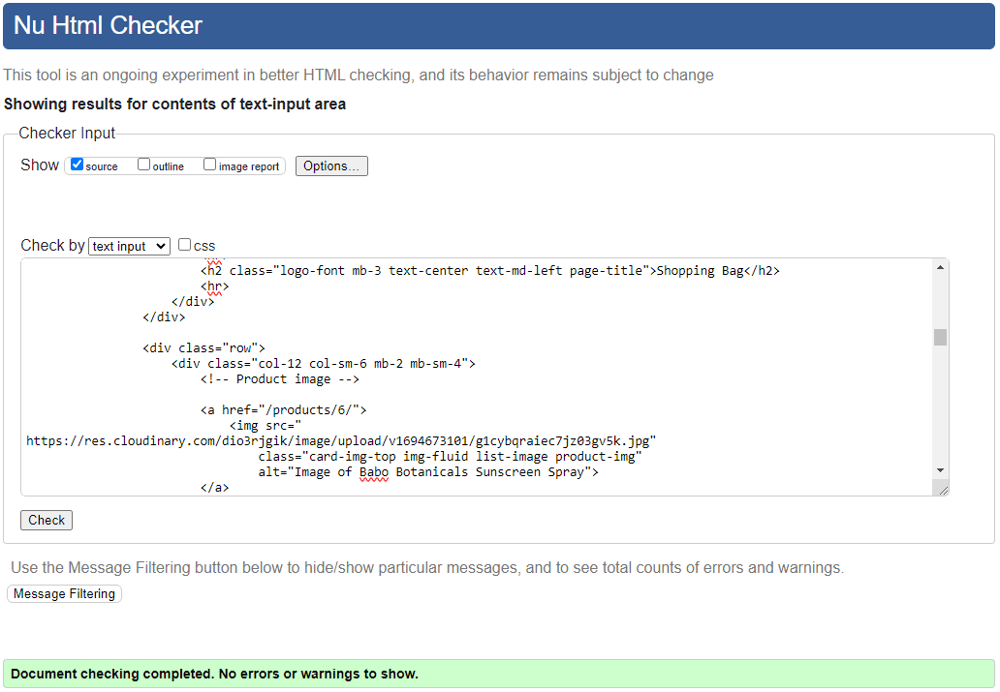
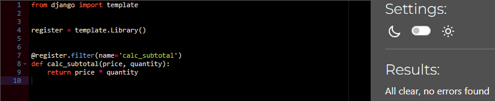

# LUVE | Testing

Return to [README](https://github.com/ShizukaDonaghue/luve)

## Code Validation

### HTML
All HTML pages were validated using [W3C HTML Validator](https://validator.w3.org/) to check for any issues or syntax errors. The only errors identified were related to Summernote fields and Clearable_file_input widget. Please see the results below for each page.

  
Home Page - No issues or errors

  
  

  
Sign Up Page - No issues or errors

  
  

  
Log In Page - No issues or errors

  
  

  
Log Out Page - No issues or errors

  
  

  
Articles Page - No issues or errors
 
  
  

  
Article Details Page - No issues or errors
 
  
  

  
Add Article Page - Errors identified for Summernote fields & clearable_file_input widget
 
  
  
  
  

There were 10 errors identified in total. The first 9 errors were related to the Summernote widget that is used in the article form. Since the errors resulted from Summernote codes, these were not addressed. The last error was related to clearable_file_input widget used for the image field within the form and thus this was not addressed as modifying it would break the code. While these errors were not addressed, they do not affect the functionality of the application.

  
Edit Article Page - Errors identified for Summernote fields & clearable_file_input widget
 
  
  
  
  

There were 10 errors identified in total. The first 9 errors were related to the Summernote widget that is used in the article form. Since the errors resulted from Summernote codes, these were not addressed. The last error was related to clearable_file_input widget used for the image field within the form and thus this was not addressed as modifying it would break the code. While these errors were not addressed, they do not affect the functionality of the application.

  
Shopping Bag Page - No issues or errors
 
  
  

  
Checkout Page - No issues or errors
 
  
  

  
Checkout Success Page - No issues or errors
 
  
  

  
Contact Page - No issues or errors
 
  
  

  
Contact Success Page - No issues or errors
 
  
  

  
Products Page - No issues or errors

  
  

  
Product Details Page - No issues or errors
 
  
  

  
Add Product Page - Error identified for clearable_file_input widget
 
  
  

One error was identified for the image field, which was related to clearable_file_input widget used within the product form. This error was not addressed as modifying the widget would break the code, however, it does not affect the functionality of the application.

  
Edit Product Page - Error identified for clearable_file_input widget
 
  
  

One error was identified for the image field, which was related to clearable_file_input widget used within the product form. This error was not addressed as modifying the widget would break the code, however, it does not affect the functionality of the application.

  
Edit Review Page - No issues or errors
 
  
  

  
Profile Page - No issues or errors
 
  
  

  
404 Error Page - No issues or errors
 
  
  

  
Wishlist Page - No issues or errors
 
  
  

  
Privacy Policy Page - No issues or errors
 
  
  

  
Terms and Conditions Page - No issues or errors
 
  
  

### CSS
CSS codes used in the application were validated using [W3C CSS Validator](https://jigsaw.w3.org/css-validator/) and no issues or errors were found.

  
Base CSS Codes - No issues or errors
 
  
  

  
Checkout CSS Codes - No issues or errors
 
  
  

  
Contact CSS Codes - No issues or errors
 
  
  

  
Profile CSS Codes - No issues or errors
 
  
  

### JavaScript
JavaScript codes used in the application were validated using [JSHint](https://jshint.com/). While there were 2 undefined variables identified, there were no critical errors. Please see the results below for each file.

  
Base JavaScript Codes - Undefined variable identified 
 
  
  

Undefined variable "checkout" was identified for the order form. This calls for `checkout()` function in checkout/views.py and not defined within the file. This was necessary as jQuery validation would submit the form before Stripe could processs the payment, causing the payment to fail (more details in [#86](https://github.com/ShizukaDonaghue/luve/issues/86)).

  
Countryfield JavaScript Codes - No issues or errors
 
  
  

  
Stripe Elements JavaScript Codes - Undefined variable identified
 
  
  

Undefined variable "Stripe" was identified, however, this was addressed as it belongs to the external Stripe API. 

### Python
Python codes used throughout the application were validated using [CI Python Linter](https://pep8ci.herokuapp.com/) and no issues or errors were found.
Please see the results for each page.

#### LUVE Project

  
settings.py - No issues or errors
 
  
  

Note: `# noqa` was added to Django generated codes under `AUTH_PASSWORD_VALIDATORS` and also Cloudinary storage under `STATICFILES_STORAGE` for "line too long" errors to be ignored as these could not be shortened.

  
urls.py - No issues or errors
 
  
  

  
views.py - No issues or errors
 
  
  

#### Articles App

  
admin.py - No issues or errors
 
  
  

  
forms.py - No issues or errors
 
  
  

  
models.py - No issues or errors
 
  
  

  
urls.py - No issues or errors
 
  
  

  
validators.py - No issues or errors
 
  
  

  
views.py - No issues or errors
 
  
  

  
widgets.py - No issues or errors
 
  
  

#### Bag App

  
bag_tools.py - No issues or errors
 
  
  

  
contexts.py - No issues or errors
 
  
  

  
urls.py - No issues or errors
 
  
  

  
views.py - No issues or errors
 
  
  

#### Checkout App

  
admin.py - No issues or errors
 
  
  

  
forms.py - No issues or errors
 
  
  

  
models.py - No issues or errors
 
  
  

  
signals.py - No issues or errors
 
  
  

  
urls.py - No issues or errors
 
  
  

  
views.py - No issues or errors
 
  
  

  
webhook_handler.py - No issues or errors
 
  
  

  
webhooks.py - No issues or errors
 
  
  

#### Contact App

  
admin.py - No issues or errors
 
  
  

  
forms.py - No issues or errors
 
  
  

  
models.py - No issues or errors
 
  
  

  
urls.py - No issues or errors
 
  
  

  
views.py - No issues or errors
 
  
  

#### Home App

  
contexts.py - No issues or errors
 
  
  

  
urls.py - No issues or errors
 
  
  

  
views.py - No issues or errors
 
  
  

#### Products App

  
admin.py - No issues or errors
 
  
  

  
forms.py - No issues or errors
 
  
  

  
models.py - No issues or errors
 
  
  

  
urls.py - No issues or errors
 
  
  

  
views.py - No issues or errors
 
  
  

  
widgets.py - No issues or errors
 
  
  

#### Profiles App

  
forms.py - No issues or errors
 
  
  

  
models.py - No issues or errors
 
  
  

  
urls.py - No issues or errors
 
  
  

  
views.py - No issues or errors
 
  
  

### Wishlist App

  
admin.py - No issues or errors
 
  
  

  
contexts.py - No issues or errors
 
  
  

  
models.py - No issues or errors
 
  
  

  
urls.py - No issues or errors
 
  
  

  
views.py - No issues or errors
 
  
  

## Lighthouse
Lighthouse in [Chrome Dev Tools](https://developer.chrome.com/docs/devtools/) was used to test accessibility and performance.
Please see the results below for each page.

  
Home Page

  
  Desktop:  
  

  Mobile:  
  
	

  
Articles Page

  
  Desktop:  
  

  Mobile:  
  
	

  
Article Detail Page

  
  Desktop:  
  

  Mobile:  
  
	

  
Add Article Page

  
  Desktop:  
  

  Mobile:  
  
	

  
Shopping Bag Page

  
  Desktop:  
  

  Mobile:  
  
	

  
Checkout Page

  
  Desktop:  
  

  Mobile:  
  
	

  
Checkout Success Page

  
  Desktop:  
  

  Mobile:  
  
	

