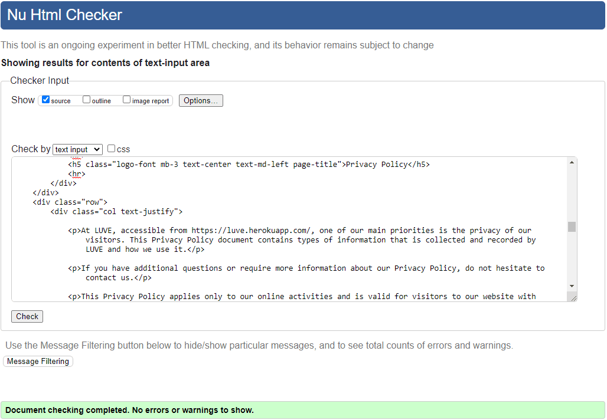
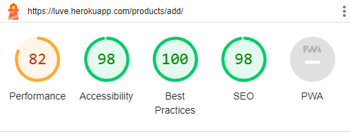
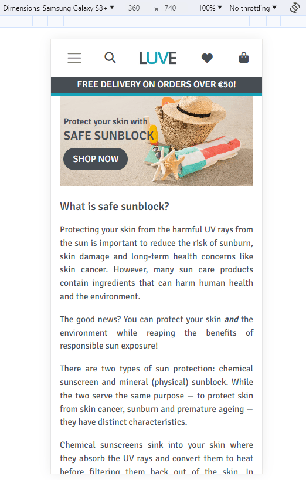

# LUVE | Testing

Return to [README](https://github.com/ShizukaDonaghue/luve)

## Code Validation

### HTML
All HTML pages were validated using [W3C HTML Validator](https://validator.w3.org/) to check for any issues or syntax errors. The only errors identified were related to Summernote fields and Clearable_file_input widget. Please see the results below for each page.

  
Home Page - No issues or errors

  
  

  
Sign Up Page - No issues or errors

  
  

  
Log In Page - No issues or errors

  
  

  
Log Out Page - No issues or errors

  
  

  
Articles Page - No issues or errors
 
  
  

  
Article Details Page - No issues or errors
 
  
  

  
Add Article Page - Errors identified for Summernote fields & clearable_file_input widget
 
  
  
  
  

There were 10 errors identified in total. The first 9 errors were related to the Summernote widget that is used in the article form. Since the errors resulted from Summernote codes, these were not addressed. The last error was related to clearable_file_input widget used for the image field within the form and thus this was not addressed as modifying it would break the code. While these errors were not addressed, they do not affect the functionality of the application.

  
Edit Article Page - Errors identified for Summernote fields & clearable_file_input widget
 
  
  
  
  

There were 10 errors identified in total. The first 9 errors were related to the Summernote widget that is used in the article form. Since the errors resulted from Summernote codes, these were not addressed. The last error was related to clearable_file_input widget used for the image field within the form and thus this was not addressed as modifying it would break the code. While these errors were not addressed, they do not affect the functionality of the application.

  
Shopping Bag Page - No issues or errors
 
  
  

  
Checkout Page - No issues or errors
 
  
  

  
Checkout Success Page - No issues or errors
 
  
  

  
Contact Page - No issues or errors
 
  
  

  
Contact Success Page - No issues or errors
 
  
  

  
Products Page - No issues or errors

  
  

  
Product Details Page - No issues or errors
 
  
  

  
Add Product Page - Error identified for clearable_file_input widget
 
  
  

One error was identified for the image field, which was related to clearable_file_input widget used within the product form. This error was not addressed as modifying the widget would break the code, however, it does not affect the functionality of the application.

  
Edit Product Page - Error identified for clearable_file_input widget
 
  
  

One error was identified for the image field, which was related to clearable_file_input widget used within the product form. This error was not addressed as modifying the widget would break the code, however, it does not affect the functionality of the application.

  
Edit Review Page - No issues or errors
 
  
  

  
Profile Page - No issues or errors
 
  
  

  
404 Error Page - No issues or errors
 
  
  

  
Wishlist Page - No issues or errors
 
  
  

  
Privacy Policy Page - No issues or errors
 
  
  

  
Terms and Conditions Page - No issues or errors
 
  
  

### CSS
CSS codes used in the application were validated using [W3C CSS Validator](https://jigsaw.w3.org/css-validator/) and no issues or errors were found.

  
Base CSS Codes - No issues or errors
 
  
  

  
Checkout CSS Codes - No issues or errors
 
  
  

  
Contact CSS Codes - No issues or errors
 
  
  

  
Profile CSS Codes - No issues or errors
 
  
  

### JavaScript
JavaScript codes used in the application were validated using [JSHint](https://jshint.com/). While there were 2 undefined variables identified, there were no critical errors. Please see the results below for each file.

  
Base JavaScript Codes - Undefined variable identified 
 
  
  

Undefined variable "checkout" was identified for the order form. This calls for `checkout()` function in checkout/views.py and not defined within the file. This was necessary as jQuery validation would submit the form before Stripe could processs the payment, causing the payment to fail (more details in [#86](https://github.com/ShizukaDonaghue/luve/issues/86)).

  
Countryfield JavaScript Codes - No issues or errors
 
  
  

  
Stripe Elements JavaScript Codes - Undefined variable identified
 
  
  

Undefined variable "Stripe" was identified, however, this was addressed as it belongs to the external Stripe API. 

### Python
Python codes used throughout the application were validated using [CI Python Linter](https://pep8ci.herokuapp.com/) and no issues or errors were found.
Please see the results for each page.

#### LUVE Project

  
settings.py - No issues or errors
 
  
  

Note: `# noqa` was added to Django generated codes under `AUTH_PASSWORD_VALIDATORS` and also Cloudinary storage under `STATICFILES_STORAGE` for "line too long" errors to be ignored as these could not be shortened.

  
urls.py - No issues or errors
 
  
  

  
views.py - No issues or errors
 
  
  

#### Articles App

  
admin.py - No issues or errors
 
  
  

  
forms.py - No issues or errors
 
  
  

  
models.py - No issues or errors
 
  
  

  
urls.py - No issues or errors
 
  
  

  
validators.py - No issues or errors
 
  
  

  
views.py - No issues or errors
 
  
  

  
widgets.py - No issues or errors
 
  
  

#### Bag App

  
bag_tools.py - No issues or errors
 
  
  

  
contexts.py - No issues or errors
 
  
  

  
urls.py - No issues or errors
 
  
  

  
views.py - No issues or errors
 
  
  

#### Checkout App

  
admin.py - No issues or errors
 
  
  

  
forms.py - No issues or errors
 
  
  

  
models.py - No issues or errors
 
  
  

  
signals.py - No issues or errors
 
  
  

  
urls.py - No issues or errors
 
  
  

  
views.py - No issues or errors
 
  
  

  
webhook_handler.py - No issues or errors
 
  
  

  
webhooks.py - No issues or errors
 
  
  

#### Contact App

  
admin.py - No issues or errors
 
  
  

  
forms.py - No issues or errors
 
  
  

  
models.py - No issues or errors
 
  
  

  
urls.py - No issues or errors
 
  
  

  
views.py - No issues or errors
 
  
  

#### Home App

  
contexts.py - No issues or errors
 
  
  

  
urls.py - No issues or errors
 
  
  

  
views.py - No issues or errors
 
  
  

#### Products App

  
admin.py - No issues or errors
 
  
  

  
forms.py - No issues or errors
 
  
  

  
models.py - No issues or errors
 
  
  

  
urls.py - No issues or errors
 
  
  

  
views.py - No issues or errors
 
  
  

  
widgets.py - No issues or errors
 
  
  

#### Profiles App

  
forms.py - No issues or errors
 
  
  

  
models.py - No issues or errors
 
  
  

  
urls.py - No issues or errors
 
  
  

  
views.py - No issues or errors
 
  
  

### Wishlist App

  
admin.py - No issues or errors
 
  
  

  
contexts.py - No issues or errors
 
  
  

  
models.py - No issues or errors
 
  
  

  
urls.py - No issues or errors
 
  
  

  
views.py - No issues or errors
 
  
  

## Lighthouse
Lighthouse in [Chrome Dev Tools](https://developer.chrome.com/docs/devtools/) was used to test accessibility and performance. Please see the results below for each page.

  
Home Page

  
  Desktop:  
  

  Mobile:  
  
	

  
Articles Page

  
  Desktop:  
  

  Mobile:  
  
	

  
Article Detail Page

  
  Desktop:  
  

  Mobile:  
  
	

  
Add Article Page

  
  Desktop:  
  

  Mobile:  
  
	

  
Edit Article Page

  
  Desktop:  
  

  Mobile:  
  
	

  
Shopping Bag Page

  
  Desktop:  
  

  Mobile:  
  
	

  
Checkout Page

  
  Desktop:  
  

  Mobile:  
  
	

  
Checkout Success Page

  
  Desktop:  
  

  Mobile:  
  
	

  
Contact Page

  
  Desktop:  
  

  Mobile:  
  
	

  
Contact Success Page

  
  Desktop:  
  

  Mobile:  
  
	

  
Products Page

  
  Desktop:  
  

  Mobile:  
  
	

  
Product Detail Page

  
  Desktop:  
  

  Mobile:  
  
	

  
Add Product Page

  
  Desktop:  
  

  Mobile:  
  
	

  
Edit Product Page

  
  Desktop:  
  

  Mobile:  
  
	

  
Edit Product Review Page

  
  Desktop:  
  

  Mobile:  
  
	

  
Profile Page

  
  Desktop:  
  

  Mobile:  
  
	

  
Wishlit Page

  
  Desktop:  
  

  Mobile:  
  
	

## Responsiveness
Responsiveness was tested using [Chrome Dev Tools](https://developer.chrome.com/docs/devtools/) and no issues were found. This included the following devices:

  
iPhone 5/SE

  
  

  
iPhone 6/7/8

  
  

  
iPhone 6/7/8 Plus

  
  

  
iPhone SE

  
  

  
iPhone XR

  
  

  
iPhone 12 Pro

  
  

  
iPad Air

  
  

  
iPad Mini

  
  

  
Samsung Galaxy S8+

  
  

  
Samsung Galaxy S9+

  
  

  
Microsoft Surface Pro 7

  
  

  
Microsoft Surface Duo

  
  

  
Nest Hub

  
  

  
Nest Hub Max

  
  

## Device Testing
The application was tested manually on the following devices and no issues were found:

  
iPhone 12

  
  

  
iPhone 11

  
  

  
iPad 8

  
  

  
HP Elitebook 840

  
  

## Browser Compatibility
Browser compatibility was checked for the following browsers and no issues were found:

  
Google Chrome

  
  

  
Microsoft Edge

  
  

  
Mozilla Firefox

  
  

  
Opera

  
  

## Features Testing
Manual testing was performed using Google Chrome to verify that all the features functioned as expected and that no issues were found.

### Browser Tab
Feature | Action | Expected Result | PASS/FAIL
---|---|---|---
Favicon | Display | Favicon is displayed correctly in the browser tab | PASS
Title | Display | "Safe Sunblock" is displayed as the title of the page for Home page | PASS
Title | Display | "Products" is displayed as the title of the page for Products and Brands page | PASS
Title | Display | The name of the product is displayed as the title of the page for each Product Details page | PASS
Title | Display | "Articles" is displayed as the title of the page for Articels | PASS
Title | Display | The name of the article is displayed as the title of the page for each Article Details page | PASS
Title | Display | "Contact Us" is displayed as the title of the page for Contact page | PASS
Title | Display | "Thank you!" is displayed as the title of the page for Contact Success page | PASS
Title | Display | "Product Management" is displayed as the title of the page for Add Product page | PASS
Title | Display | "Edit Product" is displayed as the title of the page for Edit Prodcut page | PASS
Title | Display | "Edit Review" is displayed as the title of the page for Edit Review page | PASS
Title | Display | "Article Management" is displayed as the title of the page for Add Article page | PASS
Title | Display | "Edit Article" is displayed as the title of the page for Edit Article page | PASS
Title | Display | "My Profile" is displayed as the title of the page for My Profile page | PASS
Title | Display | "Wishlist" is displayed as the title of the page for Wishlist page | PASS
Title | Display | "Shopping Bag" is displayed as the title of the page for Shopping Bag page | PASS
Title | Display | "Checkout" is displayed as the title of the page for Checkout page | PASS
Title | Display | "Thank you!" is displayed as the title of the page for Checkout Success page | PASS
Title | Display | "Sign Up" is displayed as the title of the page for Sign Up page | PASS
Title | Display | "Log In" is displayed as the title of the page for Log In page | PASS
Title | Display | "Log Out" is displayed as the title of the page for Log Out page | PASS

### Navigation Bar
Feature | Action | Expected Result | PASS/FAIL
---|---|---|---
Navbar Menus | Display | Menus are correctly displayed according to the screen sizes | PASS
Position | Display | Navbar always stays at the top of the screen | PASS
Logo | Click | Navigates to Home page | PASS
Search | Click | Search query functions correctly and display the product listing based on the search query | PASS
Search | Click | If the search field is left blank, an error message is displayed to notify the user | PASS
Products Link | Click | Dropdown menu appears and once the selection is made, navigates to the specified product listing | PASS
Brands Link | Click | Dropdown menu appears and once the selection is made, navigates to the specified product listing | PASS
Articles Link | Click |Navigates to Articles page | PASS
Contact Link | Click |Navigates to Contact page | PASS
Account Link | Click | Dropdown menu appears and once the selection is made, navigates to the specified page | PASS
Wishlist Link | Click |Navigates to Wishlit page | PASS
Shopping Bag Link | Click |Navigates to Shopping Bag page | PASS
Sign Up Link | Display | Only available if the user is not logged in | PASS
Sign Up Link | Click | Navigates to Sign Up page | PASS
Log In Link | Display | Only available if the user is not logged in | PASS
Log In Link | Click | Navigates to Log In page | PASS
Log Out Link | Display | Only available if the user is logged in | PASS
Log Out Link | Click | Navigates to Log Out page | PASS
Product Management Link | Display | Only available under Account menu if the user has superuser or staff permission | PASS
Product Management Link | Click | Navigates to Add Product page | PASS
Article Management Link | Display | Only available under Account menu if the user has superuser or staff permission | PASS
Article Management Link | Click | Navigates to Add Article page | PASS
Hamburger Menu Closure | Click | Hamburger menu closes when clicked outside the menu | PASS
All Links | Hover | Colour changes to turquoise or pink with hover effect | PASS

### Delivery Banner
Feature | Action | Expected Result | PASS/FAIL
---|---|---|---
Delivery Banner | Display | When there is no item in the shopping bag, "Free delivery on orders over €50!" is displayed | PASS
Delivery Banner | Display | When there is an item/are items in the shopping bag, the remaining order value to qualify for free shipping is displayed in the "Spend €[remaining value] more for free shippping!" messsage | PASS
Delivery Banner | Display | When the order value reaches the free delivery threshold, "Horray! Free delivery on your order!" is displayed | PASS

### Footer
Feature | Action | Expected Result | PASS/FAIL
---|---|---|---
Position | Display | Footer always stays at the bottom of the screen  | PASS
Newsletter Signup | Click | When the user eneters their email address, the email address is registered with Mailchimp account | PASS
Newsletter Signup | Click | When the user eneters their email address, the user is notified that they have subscribed the the newsletter | PASS
Newsletter Signup | Click | If the email is already registered, the user is notified that they have already subscribed the the newsletter | PASS
Newsletter Signup | Click | If the email field is left blank when the form is submitted, the user is notified that the email address is a required field | PASS
Contact Link | Click |Navigates to Contact page | PASS
Privacy Policy Link | Click |Navigates to Privacy Policy page | PASS
Terms & Conditions Link | Click |Navigates to Terms & Conditions page | PASS
Facebook Link | Click | Opens Facebook in a new tab | PASS
X Link | Click | Opens X in a new tab | PASS
Instagram Link | Click | Opens Instagram in a new tab | PASS
GitHub Link | Click | Opens GitHub in a new tab | PASS
All Links | Hover | Colour changes to turquoise with hover effect | PASS

### Sign Up Page
Feature | Action | Expected Result | PASS/FAIL
---|---|---|---
Email Field | Leave Empty | The sign up form does not submit | PASS
Email Field | Leave Empty | An error message is displayed | PASS
Email Field | Enter Invalid Format | The sign up form does not submit | PASS
Email Field | Enter Invalid Format | An error message is displayed | PASS
Email Field | Duplicate Email Address | The sign up form does not submit | PASS
Email Field | Duplicate Email Address | An error message is displayed | PASS
Username Field | Leave Empty | The sign up form does not submit | PASS
Username Field | Leave Empty | An error message is displayed | PASS
Username Field | Enter an Empty String | The sign up form does not submit | PASS
Username Field | Enter an Empty String | An error message is displayed | PASS
Username Field | Duplicate Username | The sign up form does not submit | PASS
Username Field | Duplicate Username | An error message is displayed | PASS
Password Field | Leave Empty | The sign up form does not submit | PASS
Password Field | Leave Empty | An error message is displayed | PASS
Password Field | Enter an Empty String | The sign up form does not submit | PASS
Password Field | Enter an Empty String | An error message is displayed | PASS
Password Field | Passwords Not Matched | The sign up form does not submit | PASS
Password Field | Passwords Not Matched | An error message is displayed | PASS
Log In Link | Click | Navigates to Log In page | PASS
Sign Up Link | Click | Once all the required fields are correctly filled in, an email is sent to the user with a link to confirm their email address | PASS
Sign Up Link | Click | Once all the user confirms their email address, they are registerd as a user in the database | PASS
Alert | Display | Success message is displayed once the email confirmation with a link is sent to the user  | PASS
Alert | Display | Success message is displayed once the user confirms their email address | PASS

### Log In Page
Feature | Action | Expected Result | PASS/FAIL
---|---|---|---
Username Field | Leave Empty | The login form does not submit | PASS
Username Field | Leave Empty | An error message is displayed | PASS
Username Field | Enter an Empty String | The login form does not submit | PASS
Username Field | Enter an Empty String | An error message is displayed | PASS
Password Field | Leave Empty | The login form does not submit | PASS
Password Field | Leave Empty | An error message is displayed | PASS
Password Field | Enter an Empty String | The login form does not submit | PASS
Password Field | Enter an Empty String | An error message is displayed | PASS
Login Fields | Incorrect Details | The login form does not submit | PASS
Login Fields | Incorrect Details | An error message is displayed | PASS
Sign Up Link | Click | Navigates to Sign Up page | PASS
Password Reset | Click | Navigates to Password Rest page | PASS
Log In Link | Click | Once the required fields are correctly filled in, logs in the user | PASS
Log In Link | Click | Once the user is logged in, navigates to Home page | PASS
Alert | Display | Success message is displayed confirming the user has logged in as [username] | PASS

### Password Rest Page
Feature | Action | Expected Result | PASS/FAIL
---|---|---|---
Email Field | Leave Empty | The password rest form does not submit | PASS
Email Field | Leave Empty | An error message is displayed | PASS
Email Field | Enter Invalid Format | The password rest form does not submit | PASS
Email Field | Enter Invalid Format | An error message is displayed | PASS
Log In Link | Click | Navigates to Log In page | PASS
Reset Password Link | Click | Once the correct email is entered, an email containg a link to reset the password is set to the user | PASS

### Change Password Page
Feature | Action | Expected Result | PASS/FAIL
---|---|---|---
Password Field | Leave Empty | The change password form does not submit | PASS
Password Field | Leave Empty | An error message is displayed | PASS
Password Field | Enter an Empty String | The change password form does not submit | PASS
Password Field | Enter an Empty String | An error message is displayed | PASS
Change Password Link | Once the new password is correctly entered, the user's password is changed.
Log In Link | Click | Navigates to Log In page | PASS
Alert | Display | Success message is displayed confirming the password has been changed | PASS

### Logo Out Page
Feature | Action | Expected Result | PASS/FAIL
---|---|---|---
Log Out Link | Click | Once the user confirms logout, the user is logged out | PASS
Log Out Link | Click | Once the user is logged out, navigates to Home page | PASS
Cancel | Click | Navigates to Home page | PASS
Alert | Display | Success message is displayed confirming that the user has logged out | PASS

### Home Page
Feature | Action | Expected Result | PASS/FAIL
---|---|---|---
Shop Now Link | Click | Navigates to Products page | PASS
Articles Link | Click | Navigates to Articles page | PASS

### Products Page

#### Sorting Functionality
Feature | Action | Expected Result | PASS/FAIL
---|---|---|---
Price (Low to High) | Click | Sorts the product listing by price in ascending order | PASS
Price (High to Low) | Click | Sorts the product listing by price in descending order | PASS
Name (A to Z) | Click | Sorts the product listing by product name in ascending order | PASS
Name (Z to A) | Click | Sorts the product listing by product name in descending order | PASS
Category (A to Z ) | Click | Sorts the product listing by category name in ascending order | PASS
Category (Z to A ) | Click | Sorts the product listing by category name in descending order | PASS

#### Product Cards
Feature | Action | Expected Result | PASS/FAIL
---|---|---|---
Product Card | Display | Products are displayed in alphabetial order unless product sorting is applied | PASS
Product Card | Hover | Box shadow is applied with hover effect | PASS
Product Card Height | Display | Product cards are displayed at the same height for each row regardless of the height of the card body content (when the height of a card is higher, the rest of the cards in the same row are stretched to the same height) | PASS  
Product Card Width | Display | Product cards are displayed in the same width for each column and column width is the same for all columns displayed | PASS
Product Image | Display | When a Product image is uploaded, the image is displayed correctly from Cloudinary | PASS
Product Image | Display | When a Product image is not uploaded, the placeholder image is displayed correctly from Cloudinary | PASS
Product Image | Click | When clicked, navigates to the Product Detail page | PASS
Image Size | Display | Images are displayed in the same height and width regardless of the size or aspect ratio of the images uploaded | PASS
Product Name | Display | First letter is always capitalised regardless of whether the title entered is capitalised | PASS
Product Name Link | Click | Navigates to the Product Detail page | PASS
Brand Name Link | Click | Displays the product listing by the selected brand | PASS
Application Type Link | Click | Displays the product listing by the selected application type | PASS
Edit Link | Display | Displayed only if the user has superuser or staff permission | PASS
Edit Link | Click | Navigates to Edit Product page | PASS
Delete Link | Display | Displayed only if the user has superuser or staff permission | PASS
Delete Link | Click | Once clicked, a modal is displayed to confirm deletion | PASS

#### Add to Bag 
Feature | Action | Expected Result | PASS/FAIL
---|---|---|---
Add to Bag Button | Click | Once clicked, the item is added to the shopping bag if the total order quantity of the item is not greater than the maximum order quantity of 20 | PASS
Add to Bag Button | Click | If the total order quantity of the item is already at the maximum order quantity of 20, the item is not added to the shopping bag | PASS
Order Value | Display | Once the item is added to the shopping bag, the order value is displayed under the Bag icon in the navbar | PASS
Alert | Display | Once the item is added to the shopping bag, a success toast is displayed with the order details, confirming the the item has been added to the shopping bag | PASS
Alert | Display | If the total order quantity of the item is already at the maximum order quantity of 20, an error message is displayed notifying the user of the error | PASS

#### Add to or Remove from Wishlist
Feature | Action | Expected Result | PASS/FAIL
---|---|---|---
Add to Wishlist | Click | If the user is not logged in, navigates to the Login page | PASS 
Add to Wishlist | Click | If the user is logged in and if the item is not already in their wishlist, the item is added to the wishlist | PASS
Remove from Wishlist | Click | If the user is logged in and if the item is already in their wishlist, the item is removed from the wishlist | PASS
Alert | Display | If the user is not logged in, an alert is display to the user to let them know that they need to log in to add the item to their wishlist | PASS
Alert | Display | Once the item is added to the wishlist, a success toast is displayed with the wishlist details, confirming that the item has been added to the wishlist | PASS
Alert | Display | Once the item is removed from the wishlist, a success toast is displayed with the wishlist details, confirming that the item has been removed from the wishlist | PASS
Wishlist Count | Display | Once an item is added to or removed from the wishlist, the number of items in the wishlist is updated next to the Wishlist icon in the navbar | PASS

### Product Details Page
#### Product Image
Feature | Action | Expected Result | PASS/FAIL
---|---|---|---
Product Image | Display | When a Product image is uploaded, the image is displayed correctly from Cloudinary | PASS
Product Image | Display | When a Product image is not uploaded, the placeholder image is displayed correctly from Cloudinary | PASS
Product Image | Click | Once clicked, the larger size of the image is displayed from Cloudinary | PASS

#### Add to or Remove from Wishlist
Feature | Action | Expected Result | PASS/FAIL
---|---|---|---
Add to Wishlist | Click | If the user is not logged in, navigates to the Login page | PASS 
Add to Wishlist | Click | If the user is logged in and if the item is not already in their wishlist, the item is added to the wishlist | PASS
Remove from Wishlist | Click | If the user is logged in and if the item is already in their wishlist, the item is removed from the wishlist | PASS
Alert | Display | If the user is not logged in, an alert is display to the user to let them know that they need to log in to add the item to their wishlist | PASS
Alert | Display | Once the item is added to the wishlist, a success toast is displayed with the wishlist details, confirming that the item has been added to the wishlist | PASS
Alert | Display | Once the item is removed from the wishlist, a success toast is displayed with the wishlist details, confirming that the item has been removed from the wishlist | PASS
Wishlist Count | Display | Once an item is added to or removed from the wishlist, the number of items in the wishlist is updated next to the Wishlist icon in the navbar | PASS

#### Product Information
Feature | Action | Expected Result | PASS/FAIL
---|---|---|---
Product Title | Display | First letter is always capitalised regardless of whether the title entered is capitalised | PASS
Product Description | Display | First letter is always capitalised regardless of whether the description entered is capitalised | PASS

#### Edit & Delete Product Links
Feature | Action | Expected Result | PASS/FAIL
---|---|---|---
Edit Link | Display | Displayed only if the user has superuser or staff permission | PASS
Edit Link | Click | Navigates to Edit Product page | PASS
Delete Link | Display | Displayed only if the user has superuser or staff permission | PASS
Delete Link | Click | Once clicked, a modal is displayed to confirm deletion | PASS

#### Order Quantity & Add to Bag
Feature | Action | Expected Result | PASS/FAIL
---|---|---|---
Order Quantity | Select | Decrement and increment buttons only allow a quantity between 1 and the maximum order quantity of 20 | PASS
Add to Bag | Click | If the total order quantity of the item is between 1 and the maximum order quantity of 20, the selected quantity of the item is added to the shopping bag | PASS
Add to Bag | Click | If the total order quantity of the item is not between 1 and the maximum order quantity of 20, the item is not added to the shopping bag | PASS
Order Value | Display | Once the item is added to the shopping bag, the order value is displayed under the Bag icon in the navbar | PASS
Alert | Display | Once the item is added to the shopping bag, a success toast is displayed with the order details, confirming the the item has been added to the shopping bag | PASS
Alert | Display | If the total order quantity of the item is not between 1 and the maximum order quantity of 20, an error message is displayed notifying the user of the error | PASS

#### Links to Other Pages
Feature | Action | Expected Result | PASS/FAIL
---|---|---|---
All Products Link | Click | Navigates to Products page | PASS
Continue Shopping Button | Click | Navigates back to the Products page | PASS

#### Customer Reviews
Feature | Action | Expected Result | PASS/FAIL
---|---|---|---
Reviews | Display | If there are no reviews, "Be the first to review or rate this product!" is displayed | PASS
Reviews | Display | If there are reviews, displays them in ascending order based on posting dates | PASS
Ratings | Display | The star ratings are correctly displayed based on the rating selected | PASS
Post Review | Display | If the user is not logged in, "Please log in to leave a review!" is displayed | PASS
Post Review | Display | If the user is logged in, the review form is available to post a review | PASS
Post Review | Display | First letter is always capitalised regardless of whether the content entered is capitalised | PASS
Post Review | Leave Empty | The content field can be left blank if the user would like to rate the product only | PASS
Post Review | Submit | Once the form is submitted, review and/or rating is/are added to the database and displayed in the review section | PASS
Alert | Display | Success message is displayed confirming the Review has been added successfully | PASS
Edit/Delete Review Dropdown Menu | Display | Edit/Delete menu is available if the user is logged in and is the author of the review | PASS
Edit Review Button | Click | Navigates to Edit Review page | PASS
Delete Review Button | Click | a modal is displayed to confirm deletion | PASS

### Edit Review Page
Feature | Action | Expected Result | PASS/FAIL
---|---|---|---
Defensive Measure | Not Logged-in and Try to Access the Edit Review Page by Entering the URL | Navigates the user to Login page | PASS
Defensive Measure | Logged-in and Try to Access Another User's Review by Entering the URL | An error message is displayed notifying the user that they are not authorised to edit the review | PASS
Edit Review Form | Display | The details in the form are populated from the database | PASS
Review Field | Leave Empty | The content field can be left blank if the user would like to rate the product only | PASS
Edite Review | Click | Review is updated and displayed in the review section | PASS
Alert | Display | Success message is displayed confirming that the review has been updated successfully | PASS
Cancel Button | Click | Navigates back to Product Detail page | PASS

### Delete Review Modal
Feature | Action | Expected Result | PASS/FAIL
---|---|---|---
Delete Review| Submit | Once the user confirms deletion in the modal, the review is deleted | PASS
Alert | Display | Success message is displayed confirming that the review has been deleted | PASS
Cancel Button | Click | Modal is closed | PASS
Modal Closure | Click Outside Menu | Modal is closed | PASS 

### Add Product Page
Feature | Action | Expected Result | PASS/FAIL
---|---|---|---
Defensive Measure | Not Logged-in and Try to Acess the Add Product Page by Entering the URL | Navigates the user to Login page | PASS
Defensive Measure | Logged-in and Try to Access the Add Product Page by Entering the URL without Superuser or Staff Permission  | An error message is displayed notifying the user that they are not authorised to add products | PASS
Category | Not Selected | Defaults to "Baby & Kids and Kids" and the product form submits as this is not a required field | PASS
Brand | Leave Empty | The product form submits as this is not a required field | PASS
Type | Leave Empty | The product form submits as this is not a required field | PASS
SKU | Leave Empty | The product form submits as this is not a required field | PASS
Product Name | Leave Empty | The product form does not submit | PASS
Product Name | Leave Empty | An error message is displayed to the user notifying them that this is a required field | PASS
Product Name | Enter an Empty String | The product form does not submit | PASS
Product Name | Enter an Empty String | An error message is displayed to the user notifying them that this is a required field | PASS
Description | Leave Empty | The product form does not submit | PASS
Description | Leave Empty | An error message is displayed to the user notifying them that this is a required field | PASS
Description | Enter an Empty String | The form does not submit | PASS
Description | Enter an Empty String | An error message is displayed to the user notifying them that this is a required field | PASS
Price | Enter a Price less than 0.01 | The product form does not submit | PASS
Price | Enter a Price less than 0.01 | An error message is displayed to the user notifying them that the price must be greater than or equal to 0.01 | PASS
Image | Not Uploaded | The product form submits as this is not a required field | PASS
Image | Click to Upload | Opens a file explorer to select an image from | PASS
Image | Click to Upload | The name of the image selected is displayed under the "Select Image" button | PASS
Add Product | Submit | Displays the Product Details page which has been generated | PASS
Alert | Display | Success message is displayed confirming [Product Name] has been added successfully | PASS
Cancel Button | Click | Navigates back to Products page | PASS

### Edit Product Page
Feature | Action | Expected Result | PASS/FAIL
---|---|---|---
Defensive Measure | Not Logged-in and Try to Access the Edit Product Page by Entering the URL | Navigates the user to Login page | PASS
Defensive Measure | Logged-in and Try to Access the Edit Product Page by Entering the URL without Superuser or Staff Permission | An error message is displayed notifying the user that they are not authorised to edit products | PASS
Edit Product Form | Display | The details in the form are populated from the database | PASS
Category | Not Selected | Defaults to "Baby & Kids and Kids" and the product form submits as this is not a required field | PASS
Brand | Leave Empty | The product form submits as this is not a required field | PASS
Type | Leave Empty | The product form submits as this is not a required field | PASS
SKU | Leave Empty | The product form submits as this is not a required field | PASS
Product Name | Leave Empty | The product form does not submit | PASS
Product Name | Leave Empty | An error message is displayed to the user notifying them that this is a required field | PASS
Product Name | Enter an Empty String | The product form does not submit | PASS
Product Name | Enter an Empty String | An error message is displayed to the user notifying them that this is a required field | PASS
Description | Leave Empty | The product form does not submit | PASS
Description | Leave Empty | An error message is displayed to the user notifying them that this is a required field | PASS
Description | Enter an Empty String | The form does not submit | PASS
Description | Enter an Empty String | An error message is displayed to the user notifying them that this is a required field | PASS
Price | Enter a Price less than 0.01 | The product form does not submit | PASS
Price | Enter a Price less than 0.01 | An error message is displayed to the user notifying them that the price must be greater than or equal to 0.01 | PASS
Image | Not Uploaded | The product form submits as this is not a required field | PASS
Image | Click to Upload | Opens a file explorer to select an image from | PASS
Image | Click to Upload | The name of the image selected is displayed under the "Select Image" button | PASS
Edit Product | Submit | Displays the Product Details page which has been generated | PASS
Alert | Display | Success message is displayed confirming [Product Name] has been updated successfully | PASS
Cancel Button | Click | Navigates back to Products page | PASS
Update Product | Submit | Displays the Product Details page which has been updated | PASS
Alert | Submit | Success message is displayed confirming the [Product title] has been updated successfully | PASS
Cancel Button | Navigates back to Product Detail page | PASS

### Delete Product Modal
Feature | Action | Expected Result | PASS/FAIL
---|---|---|---
Delete Product from Products Page | Submit | Once the user confirms deletion in the modal, the product is deleted | PASS
Delete Product from Product Detail Page | Submit | Once the user confirms deletion in the modal, the product is deleted | PASS
Delete Product | Submit | Once the product is deleted, navigates back to Products page | PASS
Alert | Display | Success message is displayed confirming that the product has been deleted | PASS
Cancel Button | Click | Modal is closed | PASS
Modal Closure | Click Outside Menu | Modal is closed | PASS

### Articles Page
Feature | Action | Expected Result | PASS/FAIL
---|---|---|---
Article Card | Hover | Box shadow is applied with hover effect | PASS
Article Card Height | Display | Article cards are displayed at the same height for each row regardless of the height of the card body content (when the height of a card is higher, the rest of the cards in the same row are stretched to the same height) | PASS  
Article Card Width | Display | Article cards are displayed in the same width for each column and column width is the same for all columns displayed | PASS
Article Image | Display | When an article image is uploaded, the image is displayed correctly from Cloudinary | PASS
Article Image | Display | When an article image is not uploaded, the placeholder image is displayed correctly from Cloudinary | PASS
Article Image | Click | Navigates to the Article Detail page (stretched link applied for users without superuser or staff permission so they can navigate easily to the Article Detail page) | PASS
Image Size | Display | Images are displayed in the same height and width regardless of the size or aspect ratio of the images uploaded | PASS
Article Name | Display | First letter is always capitalised regardless of whether the title entered is capitalised | PASS
Article Description | Display | First letter is always capitalised regardless of whether the description entered is capitalised | PASS
Article Description | Display | The article description is truncated after 115 letters | PASS
Article Name Link | Click | Navigates to the Article Detail page (for users with superuser or staff permisision) | PASS
Number of Likes | Display | The number of likes for the article is displayed next to the article title | PASS 
Edit Link | Display | Displayed only if the user has superuser or staff permission | PASS
Edit Link | Click | Navigates to Edit Article page | PASS
Delete Link | Display | Displayed only if the user has superuser or staff permission | PASS
Delete Link | Click | Once clicked, a modal is displayed to confirm deletion | PASS

### Article Details Page

#### Article Image
Feature | Action | Expected Result | PASS/FAIL
---|---|---|---
Article Image | Display | When an Article image is uploaded, the image is displayed correctly from Cloudinary | PASS
Article Image | Display | When a Article image is not uploaded, the placeholder image is displayed correctly from Cloudinary | PASS

#### Number of Likes
Feature | Action | Expected Result | PASS/FAIL
---|---|---|---
Number of Likes | Display | The number of likes for the article is next to the article title | PASS 
Like Button | Click | If the user is not logged in, an error message is displayed notifying the user that they need to log in to like the article | PASS
Like Button | Click | If the user is logged in and if the article is not yet liked, the article is liked by the user | PASS
Like Button | Click | If the user is logged in and if the article is already liked, the article is un-liked by the user | PASS

#### Article Information
Feature | Action | Expected Result | PASS/FAIL
---|---|---|---
Article Title | Display | First letter is always capitalised regardless of whether the title entered is capitalised | PASS
Article Author | Display | The author of the article is displayed | PASS

#### Edit & Delete Article Links
Feature | Action | Expected Result | PASS/FAIL
---|---|---|---
Edit Link | Display | Displayed only if the user has superuser or staff permission | PASS
Edit Link | Click | Navigates to Edit Article page | PASS
Delete Link | Display | Displayed only if the user has superuser or staff permission | PASS
Delete Link | Click | Once clicked, a modal is displayed to confirm deletion | PASS

### Add Article Page
Feature | Action | Expected Result | PASS/FAIL
---|---|---|---
Defensive Measure | Not Logged-in and Try to Acess the Add Article Page by Entering the URL | Navigates the user to Login page | PASS
Defensive Measure | Logged-in and Try to Access the Add Article Page by Entering the URL without Superuser or Staff Permission  | An error message is displayed notifying the user that they are not authorised to add articles | PASS
Article Title | Leave Empty | The article form does not submit | PASS
Article Title | Leave Empty | An error message is displayed to the user notifying them that this is a required field | PASS
Article Title | Enter an Empty String | The article form does not submit | PASS
Article Title | Enter an Empty String | An error message is displayed to the user notifying them that this is a required field | PASS
Description | Leave Empty | The article form does not submit | PASS
Description | Leave Empty | An error message is displayed to the user notifying them that this is a required field | PASS
Description | Enter an Empty String | The form does not submit | PASS
Description | Enter an Empty String | An error message is displayed to the user notifying them that this is a required field | PASS
Content | Leave Empty | The article form does not submit | PASS
Content | Leave Empty | An error message is displayed to the user notifying them that this is a required field | PASS
Content | Enter an Empty String | The form does not submit | PASS
Content | Enter an Empty String | An error message is displayed to the user notifying them that this is a required field | PASS
Image | Not Uploaded | The article form submits as this is not a required field | PASS
Image | Click to Upload | Opens a file explorer to select an image from | PASS
Image | Click to Upload | The name of the image selected is displayed under the "Select Image" button | PASS
Add Article | Submit | Displays the Article Details page which has been generated | PASS
Alert | Display | Success message is displayed confirming [Article Title] has been added successfully | PASS
Cancel Button | Click | Navigates back to Articles page | PASS

### Edit Article Page
Feature | Action | Expected Result | PASS/FAIL
---|---|---|---
Defensive Measure | Not Logged-in and Try to Acess the Edit Article Page by Entering the URL | Navigates the user to Login page | PASS
Defensive Measure | Logged-in and Try to Access the Edit Article Page by Entering the URL without Superuser or Staff Permission  | An error message is displayed notifying the user that they are not authorised to edit articles | PASS
Edit Article Form | Display | The details in the form are populated from the database | PASS
Article Title | Leave Empty | The article form does not submit | PASS
Article Title | Leave Empty | An error message is displayed to the user notifying them that this is a required field | PASS
Article Title | Enter an Empty String | The article form does not submit | PASS
Article Title | Enter an Empty String | An error message is displayed to the user notifying them that this is a required field | PASS
Description | Leave Empty | The article form does not submit | PASS
Description | Leave Empty | An error message is displayed to the user notifying them that this is a required field | PASS
Description | Enter an Empty String | The form does not submit | PASS
Description | Enter an Empty String | An error message is displayed to the user notifying them that this is a required field | PASS
Content | Leave Empty | The article form does not submit | PASS
Content | Leave Empty | An error message is displayed to the user notifying them that this is a required field | PASS
Content | Enter an Empty String | The form does not submit | PASS
Content | Enter an Empty String | An error message is displayed to the user notifying them that this is a required field | PASS
Image | Not Uploaded | The article form submits as this is not a required field | PASS
Image | Click to Upload | Opens a file explorer to select an image from | PASS
Image | Click to Upload | The name of the image selected is displayed under the "Select Image" button | PASS
Edit Article | Submit | Displays the Article Details page which has been updated | PASS
Alert | Display | Success message is displayed confirming [Article Title] has been update successfully | PASS
Cancel Button | Click | Navigates back to Articles page | PASS

### Delete Article Modal
Feature | Action | Expected Result | PASS/FAIL
---|---|---|---
Delete Article from Articles Page | Submit | Once the user confirms deletion in the modal, the article is deleted | PASS
Delete Article from Article Detail Page | Submit | Once the user confirms deletion in the modal, the article is deleted | PASS
Delete Article | Submit | Once the article is deleted, navigates back to Articles page | PASS
Alert | Display | Success message is displayed confirming that the article has been deleted | PASS
Cancel Button | Click | Modal is closed | PASS
Modal Closure | Click Outside Menu | Modal is closed | PASS

### Contact Us Page
Feature | Action | Expected Result | PASS/FAIL
---|---|---|---
Query Type | Not Selected | The contact form does not submit | PASS
Query Type  | Not Selected | An error message is displayed to the user notifying them that this is a required field | PASS
Full Name | Leave Empty | The contact form does not submit | PASS
Full Name | Leave Empty | An error message is displayed | PASS
Full Name | Enter an Empty String | The contact form does not submit | PASS
Full Name | Enter an Empty String | An error message is displayed | PASS
Full Name | Entry | If the user is logged in, their name is populated from the database | PASS
Email Field | Leave Empty | The contact form does not submit | PASS
Email Field | Leave Empty | An error message is displayed | PASS
Email Field | Enter Invalid Format | The contact form does not submit | PASS
Email Field | Enter Invalid Format | An error message is displayed | PASS
Email Field | Entry | If the user is logged in, their email address is populated from the database | PASS
Message | Leave Empty | The contact form does not submit | PASS
Message | Leave Empty | An error message is displayed | PASS
Message | Enter an Empty String | The contact form does not submit | PASS
Message | Enter an Empty String | An error message is displayed | PASS
Contact Form | Submit | Once the completed form is submitted, a confirmation email is sent to the user notifying that their message has been received | PASS
Contact Form | Submit | Once the completed form is submitted, a notification email is sent to the business owner/staff notifying that a new message has been received | PASS
Alert | Display | Success message is displayed confirming that the user's message has been received | PASS

### Profile Page
Feature | Action | Expected Result | PASS/FAIL
---|---|---|---
Defensive Measure | Not Logged-in and Try to Acess the Profile Page by Entering the URL | Navigates the user to Login page | PASS
Delivery Adress | Entry | If the delivery address is not already saved, the logged-in user can populate and save the delivery address | PASS
Delivery Adress | Entry | If the delivery address is not already saved and if the logged-in user places an order with "Save this information to my profile" box ticked, the delivery address is saved into their profile | PASS
Delivery Adress | Update | If the delivery address is already saved, the user can update and save the delivery address | PASS
Order History | Display | If the user has placed orders, the order details are displayed in descending order based on the order dates | PASS
Order Number Link | Click | Once clicked, the order confirmation is displayed | PASS
Alert | Display | When the delivery address is updated, a success message is displayed confirming that the user profile has been updated | PASS

### Wishlist Page
Defensive Measure | Click | If the user is not logged in and try to access the Wishlist page, navigates to the Login page | PASS 
Wishlist Items | Display | Displays items the user has added to their wishlist | PASS
Remove Button | Click | Removes the item from the wishlist | PASS
Remove Button | Click | Once the item is removed from the wishlist, the number of items in the wishlist is updated next to the Wishlist icon in the navbar | PASS
Add to Bag Button | Click | Once clicked, the item is added to the shopping bag if the total order quantity of the item is not greater than the maximum order quantity of 20 | PASS
Add to Bag Button | Click | If the total order quantity of the item is already at the maximum order quantity of 20, the item is not added to the shopping bag | PASS
Order Value | Display | Once the item is added to the shopping bag, the order value is displayed under the Bag icon in the navbar | PASS
Alert | Display | Once the item is removed from the wishlist, a success toast is displayed confirming that the item has been removed from the wishlist | PASS
Alert | Display | Once the item is added to the shopping bag, a success toast is displayed with the order details, confirming the the item has been added to the shopping bag | PASS
Alert | Display | If the total order quantity of the item is already at the maximum order quantity of 20, an error message is displayed notifying the user of the error | PASS

