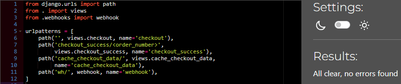
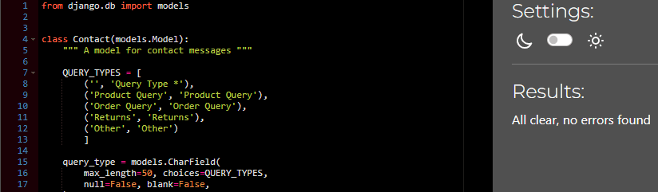
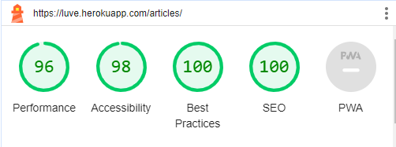
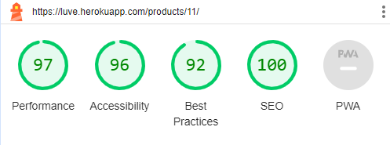
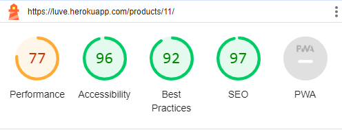
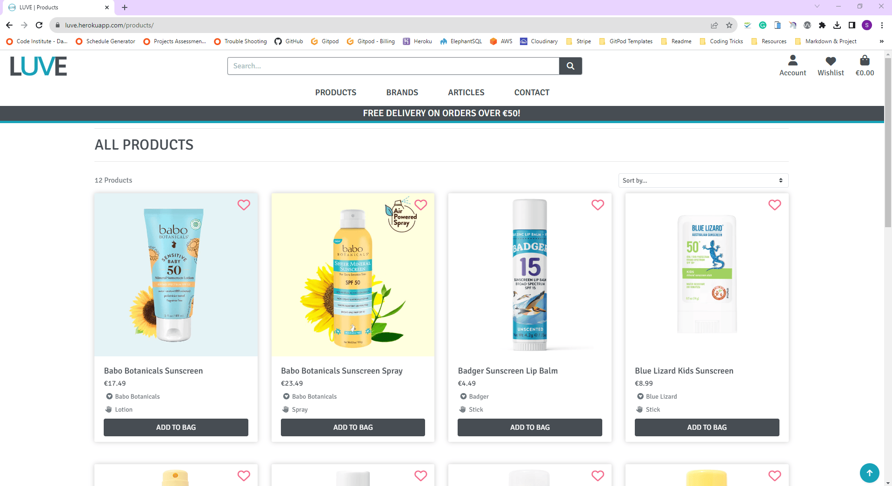
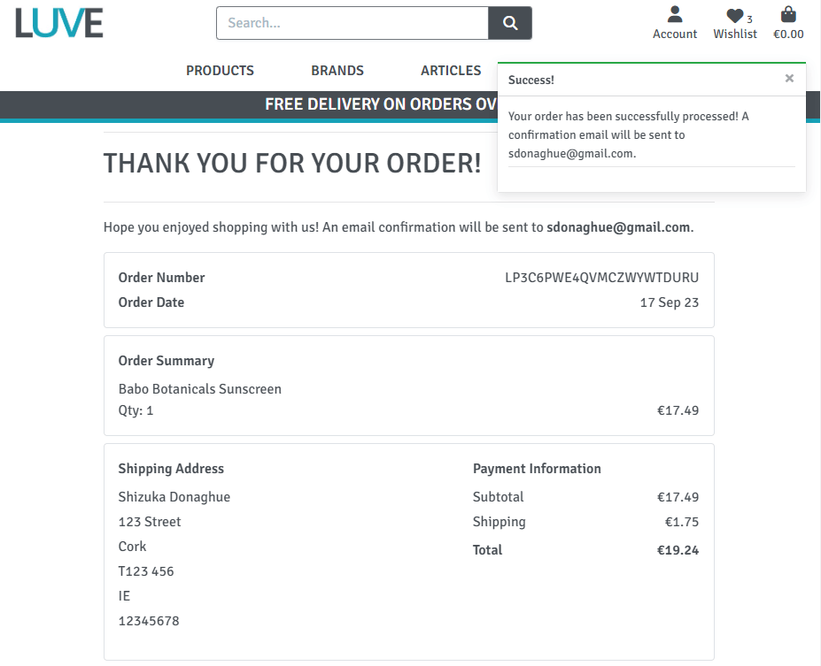
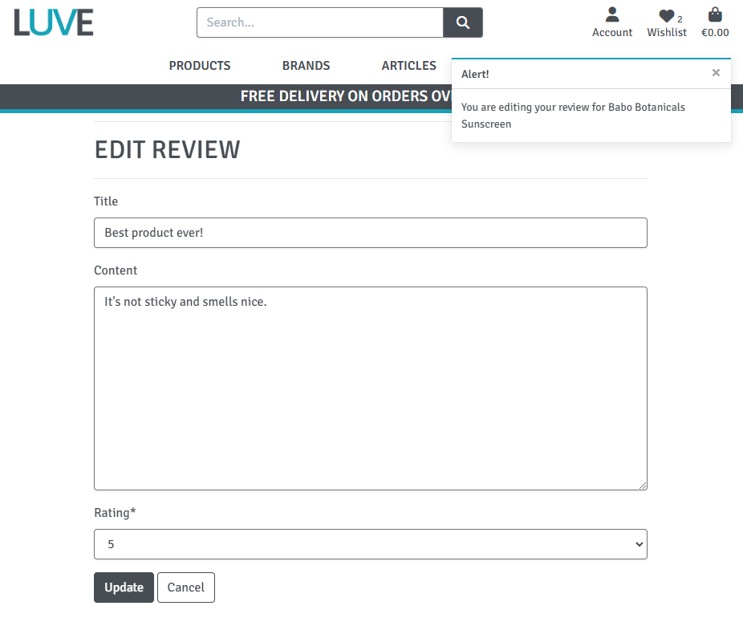

# LUVE | Testing

Return to [README](https://github.com/ShizukaDonaghue/luve)

## Code Validation

### HTML
All HTML pages were validated using [W3C HTML Validator](https://validator.w3.org/) to check for any issues or syntax errors. The only errors identified were related to Summernote fields and Clearable_file_input widget. Please see the results below for each page.

  
Home Page - No issues or errors

  
  

  
Sign Up Page - No issues or errors

  
  

  
Log In Page - No issues or errors

  
  

  
Log Out Page - No issues or errors

  
  

  
Articles Page - No issues or errors
 
  
  

  
Article Details Page - No issues or errors
 
  
  

  
Add Article Page - Errors identified for Summernote fields & clearable_file_input widget
 
  
  
  
  

There were 10 errors identified in total. The first 9 errors were related to the Summernote widget that is used in the article form. Since the errors resulted from Summernote codes, these were not addressed. The last error was related to clearable_file_input widget used for the image field within the form and thus this was not addressed as modifying it would break the code. While these errors were not addressed, they do not affect the functionality of the application.

  
Edit Article Page - Errors identified for Summernote fields & clearable_file_input widget
 
  
  
  
  

There were 10 errors identified in total. The first 9 errors were related to the Summernote widget that is used in the article form. Since the errors resulted from Summernote codes, these were not addressed. The last error was related to clearable_file_input widget used for the image field within the form and thus this was not addressed as modifying it would break the code. While these errors were not addressed, they do not affect the functionality of the application.

  
Shopping Bag Page - No issues or errors
 
  
  

  
Checkout Page - No issues or errors
 
  
  

  
Checkout Success Page - No issues or errors
 
  
  

  
Contact Page - No issues or errors
 
  
  

  
Contact Success Page - No issues or errors
 
  
  

  
Products Page - No issues or errors

  
  

  
Product Details Page - No issues or errors
 
  
  

  
Add Product Page - Error identified for clearable_file_input widget
 
  
  

One error was identified for the image field, which was related to clearable_file_input widget used within the product form. This error was not addressed as modifying the widget would break the code, however, it does not affect the functionality of the application.

  
Edit Product Page - Error identified for clearable_file_input widget
 
  
  

One error was identified for the image field, which was related to clearable_file_input widget used within the product form. This error was not addressed as modifying the widget would break the code, however, it does not affect the functionality of the application.

  
Edit Review Page - No issues or errors
 
  
  

  
Profile Page - No issues or errors
 
  
  

  
404 Error Page - No issues or errors
 
  
  

  
Wishlist Page - No issues or errors
 
  
  

  
Privacy Policy Page - No issues or errors
 
  
  

  
Terms and Conditions Page - No issues or errors
 
  
  

 

[Back to top &uarr;](https://github.com/ShizukaDonaghue/luve/blob/main/TESTING.md)  

### CSS
CSS codes used in the application were validated using [W3C CSS Validator](https://jigsaw.w3.org/css-validator/) and no issues or errors were found.

  
Base CSS Codes - No issues or errors
 
  
  

  
Checkout CSS Codes - No issues or errors
 
  
  

  
Contact CSS Codes - No issues or errors
 
  
  

  
Profile CSS Codes - No issues or errors
 
  
  

### JavaScript
JavaScript codes used in the application were validated using [JSHint](https://jshint.com/). There was one undefined variable identified for Stripe. Please see the results below for each file.

  
Base JavaScript Codes - No issues or errors 
 
  
  

  
Countryfield JavaScript Codes - No issues or errors
 
  
  

  
Stripe Elements JavaScript Codes - Undefined variable identified
 
  
  

The undefined variable "Stripe" was identified, however, this was addressed as it belongs to the external Stripe API. 

### Python
Python codes used throughout the application were validated using [CI Python Linter](https://pep8ci.herokuapp.com/) and no issues or errors were found.
Please see the results for each page.

#### LUVE Project

  
settings.py - No issues or errors
 
  
  

Note: `# noqa` was added to Django generated codes under `AUTH_PASSWORD_VALIDATORS` and also Cloudinary storage under `STATICFILES_STORAGE` for "line too long" errors to be ignored as these could not be shortened.

  
urls.py - No issues or errors
 
  
  

  
views.py - No issues or errors
 
  
  

#### Articles App

  
admin.py - No issues or errors
 
  
  

  
forms.py - No issues or errors
 
  
  

  
models.py - No issues or errors
 
  
  

  
urls.py - No issues or errors
 
  
  

  
validators.py - No issues or errors
 
  
  

  
views.py - No issues or errors
 
  
  

  
widgets.py - No issues or errors
 
  
  

#### Bag App

  
bag_tools.py - No issues or errors
 
  
  

  
contexts.py - No issues or errors
 
  
  

  
urls.py - No issues or errors
 
  
  

  
views.py - No issues or errors
 
  
  

#### Checkout App

  
admin.py - No issues or errors
 
  
  

  
forms.py - No issues or errors
 
  
  

  
models.py - No issues or errors
 
  
  

  
signals.py - No issues or errors
 
  
  

  
urls.py - No issues or errors
 
  
  

  
views.py - No issues or errors
 
  
  

  
webhook_handler.py - No issues or errors
 
  
  

  
webhooks.py - No issues or errors
 
  
  

#### Contact App

  
admin.py - No issues or errors
 
  
  

  
forms.py - No issues or errors
 
  
  

  
models.py - No issues or errors
 
  
  

  
urls.py - No issues or errors
 
  
  

  
views.py - No issues or errors
 
  
  

#### Home App

  
contexts.py - No issues or errors
 
  
  

  
urls.py - No issues or errors
 
  
  

  
views.py - No issues or errors
 
  
  

#### Products App

  
admin.py - No issues or errors
 
  
  

  
forms.py - No issues or errors
 
  
  

  
models.py - No issues or errors
 
  
  

  
urls.py - No issues or errors
 
  
  

  
views.py - No issues or errors
 
  
  

  
widgets.py - No issues or errors
 
  
  

#### Profiles App

  
forms.py - No issues or errors
 
  
  

  
models.py - No issues or errors
 
  
  

  
urls.py - No issues or errors
 
  
  

  
views.py - No issues or errors
 
  
  

### Wishlist App

  
admin.py - No issues or errors
 
  
  

  
contexts.py - No issues or errors
 
  
  

  
models.py - No issues or errors
 
  
  

  
urls.py - No issues or errors
 
  
  

  
views.py - No issues or errors
 
  
  

 

[Back to top &uarr;](https://github.com/ShizukaDonaghue/luve/blob/main/TESTING.md)  

## Lighthouse
Lighthouse in [Chrome Dev Tools](https://developer.chrome.com/docs/devtools/) was used to test accessibility and performance. Please see the results below for each page.

  
Home Page

  
  Desktop:  
  

  Mobile:  
  
	

  
Articles Page

  
  Desktop:  
  

  Mobile:  
  
	

  
Article Detail Page

  
  Desktop:  
  

  Mobile:  
  
	

  
Add Article Page

  
  Desktop:  
  

  Mobile:  
  
	

  
Edit Article Page

  
  Desktop:  
  

  Mobile:  
  
	

  
Shopping Bag Page

  
  Desktop:  
  

  Mobile:  
  
	

  
Checkout Page

  
  Desktop:  
  

  Mobile:  
  
	

  
Checkout Success Page

  
  Desktop:  
  

  Mobile:  
  
	

  
Contact Page

  
  Desktop:  
  

  Mobile:  
  
	

  
Contact Success Page

  
  Desktop:  
  

  Mobile:  
  
	

  
Products Page

  
  Desktop:  
  

  Mobile:  
  
	

  
Product Detail Page

  
  Desktop:  
  

  Mobile:  
  
	

  
Add Product Page

  
  Desktop:  
  

  Mobile:  
  
	

  
Edit Product Page

  
  Desktop:  
  

  Mobile:  
  
	

  
Edit Product Review Page

  
  Desktop:  
  

  Mobile:  
  
	

  
Profile Page

  
  Desktop:  
  

  Mobile:  
  
	

  
Wishlist Page

  
  Desktop:  
  

  Mobile:  
  
	

   

 

[Back to top &uarr;](https://github.com/ShizukaDonaghue/luve/blob/main/TESTING.md)  

## Responsiveness
Responsiveness was tested using [Chrome Dev Tools](https://developer.chrome.com/docs/devtools/) and no issues were found. This included the following devices:

  
iPhone 5/SE

  
  

  
iPhone 6/7/8

  
  

  
iPhone 6/7/8 Plus

  
  

  
iPhone SE

  
  

  
iPhone XR

  
  

  
iPhone 12 Pro

  
  

  
iPad Air

  
  

  
iPad Mini

  
  

  
Samsung Galaxy S8+

  
  

  
Samsung Galaxy S9+

  
  

  
Microsoft Surface Pro 7

  
  

  
Microsoft Surface Duo

  
  

  
Nest Hub

  
  

  
Nest Hub Max

  
  

## Device Testing
The application was tested manually on the following devices and no issues were found:

  
iPhone 12

  
  

  
iPhone 11

  
  

  
iPad 8

  
  

  
HP EliteBook 840

  
  

## Browser Compatibility
Browser compatibility was checked for the following browsers and no issues were found:

  
Google Chrome

  
  

  
Microsoft Edge

  
  

  
Mozilla Firefox

  
  

  
Opera

  
  

   

 

[Back to top &uarr;](https://github.com/ShizukaDonaghue/luve/blob/main/TESTING.md)  

## User Stories Testing
User stories were tested and addressed as follows.

### **EPIC: User Account & Profile**

* **_As a Site User, I can easily register and receive an email confirmation after registering so that I can verify that registration was successful and confirm my email address._**  

    Signup link is available in the navbar for users who are yet to register with the site, and it uses Django-allauth to manage the process.  

      

    Once the user completes the signup form with their details, they will receive an email confirming the registration and a link to confirm their email address.  
    
       

* **_As a Site User, I can easily log into my account so that I can access my personal account information._**  

    Once the user confirms their email address, they can log into their account from the login link in the navbar. The link is available for users who are not logged in already.

       

* **_As a Site User, I can recover my password in case I forget it so that recover access to my account._**  

    The link to "Forgot Password?" link is available on the Login page in case the user needs to recover their password. Once they complete this form, they will receive an email with a link to reset their password. 

* **_As a Site User, I can log out of my account so that I can keep my account secure._**   

    Logout link is available in the navbar for users who are already logged in.

      

* **_As a Site User, I can create an account so that I don't have to enter my details every time I place an order._**  

    If the user is logged in, they can save their details on their Profile page. 

      

    Alternatively, if the user is logged in and placing an order, the tick box is available in the checkout form to save the delivery details into their profile automatically. 

      

* **_As a Site User, I can create a personalised user profile so that I can view my order history and confirmation._**   

    Order history and confirmation are available on the Profile page for users who are logged in.

       

* **_As a Site User, I can view my user profile so that I can review the details stored on my account._**  

    The link to the Profile page is available in the navbar for users who are logged in. They can access the Profile page from here to view the details stored on their account.    

      

* **_As a Site User, I can edit my user profile so that I can keep my information up to date._**  

    Once the user in the Profile page, they can easily update the details stored on their account by overwriting the details and saving them. 

      

 

[Back to top &uarr;](https://github.com/ShizukaDonaghue/luve/blob/main/TESTING.md)  

### **EPIC: Site Navigation**

* **_As a Site User, I can edit my user profile so that I can keep my information up to date._**   

    The landing page introduces the site and its purpose. This page also includes "Shop Now" button so that the user can easily navigate to the store to purchase safe sunblocks and also "Article" button so that they can read more about the risks and impact of sunscreens.

       

* **_As a Site User, I can navigate the site intuitively so that I can easily find what I am looking for._**  

    A navigation bar is available on every page, which is fixed at the top of the screen for ease of use and fully responsive to all screen sizes. This allows users to navigate through the site easily. 

      

* **_As a Site User, I can browse a list of products so that I can select a product to view._**   

    Users can browse a list of products on the Products page. 
    
      
 
* **_As a Shopper, I can select a product from the list so that I can view the full details of a product._**  

    On the Products page, users can select a product to view by clicking on the product image or the name of the product, which directs them to the Product Details page.

* **_As a Shopper, I can search for a product by name or description so that I can find a specific product quickly._**  

    The search bar is available at the top where users can enter a keyword to search products by their name or description so that they can find what they are looking for quickly.

      

* **_As a Shopper, I can view a specific category or type of products so that I can easily browse the category or type of products I'm looking for._**  

    Users can choose a product category from the Products menu to find a specific category of products.  

       

    They can also choose a brand from the Brands menu for ease of use.  
    
        
    
* **_As a Shopper, I can sort the list of available products so that I can easily view a list of products based on the sorting option selected._**  

    The sorting options are available on the Products page so that users can sort the product listing.   

      

* **_As a Site User, I can see a message confirming my action so that I am notified when my action was successfully executed._**   

    Users are notified when an action has been executed. 

       

* **_As a Site User, I can see a custom error message when an HTTP error occurs so that I can understand why the error has occurred and easily navigate back to the site._**  

    A custom error page is available in case of 400, 403, 404 or 500 errors. The page includes "Return to Shop" button so that users can easily navigate back to the store. 

       
    
 

[Back to top &uarr;](https://github.com/ShizukaDonaghue/luve/blob/main/TESTING.md)  

### **EPIC: Site Admin**

* **_As a Site Admin I can create, update and delete the contents of the site so that I can manage the contents of the site._**  

    The Site Admin role has full CRUD functionality in the admin panel to manage all the contents of the site fully.

     

### **EPIC: Product Management**

* **_As a Business Owner/Staff, I can add a product to the site so that I can add new items to sell._**   

    The Product Management link is available from the Account menu for users with superuser or staff permission.
    
      

    The business owner and staff can add a product to the site from here by completing the Product form. Once the form is completed, the product is added and the user is notified.   

       

* **_As a Business Owner/Staff, I can update product details so that I can change product prices, descriptions, images and other details._**   

    The link to update the product details is available on the Products page as well as the Product Details page for users with superuser or staff permission. When the link is selected, they are directed to the Edit Product form where they can update the details. Once the complete form is submitted, the product is updated and the user is notified.

      

       
 
* **_As a Business Owner/Staff, I can delete a product so that I can remove the product which is no longer for sale._**   

    The link to delete a product is available on the Products page as well as the Product Details page for users with superuser or staff permission. When the link is selected, a modal appears to confirm deletion. Once confirmed, the product is deleted and the user is notified.

      

* **_As a Business Owner/Staff, I can see error messages when submitting the product form so that I can understand how the errors can be resolved._**   

    If there are any errors in the Add Product form, error messages are displayed explaining the error. This aims to assist users in filling in the form correctly. The form is fully validated and does not submit with invalid data.  
    
     

 

[Back to top &uarr;](https://github.com/ShizukaDonaghue/luve/blob/main/TESTING.md)  

### **EPIC: Purchasing & Checkout**

* **_As a Shopper, I can add a product to my shopping bag so that I may decide to purchase the item later._**   

    Users can add a product to the shopping bag from the Products, Product Detail and Wishlist pages.  
    
* **_As a Shopper, I can view items in my shopping bag so that I can identify the total cost of my purchases and verify the items to be purchased._**  

    Users can access their shopping bag from the bag icon in the navbar.   

       

    The Shopping Bag page lists the items in the shopping bag and users can view the total cost in the order summary.  

      

* **_As a Shopper, I can edit the shopping bag so that I can make changes to the contents of my bag before checkout._**  

    Users can easily adjust the order quantity of items on the Shopping Bag page. Items can also be removed from this page.  

* **_As a Shopper, I can see how much more I need to spend to get free delivery so that I can take advantage of the free shipping offered._**   

    The order summary section in the Shopping Bag shows the remaining spend to qualify for free shipping. This information is also available in the delivery banner under the navbar which is visible from all pages so that users can check the remaining value while they shop.  

* **_As a Shopper, I can easily view the total of my purchases at any time so that I can keep track of what I'm spending._**  

    When there is an item or are items in the bag, the total value is displayed under the Bag icon in the navbar. This is visible on all pages also so the users can keep track of their spend as they shop.  

* **_As a Shopper, I can pay for my order with a card so that I can complete my order and receive it from the business._**  

    Credit card payments are accepted on the Checkout page to complete their purchase.  

       

* **_As a Shopper, I can checkout as a guest so that I don't have to register an account to place an order._**  

    Users don't need to register as a user to purchase from the store.  

* **_As a Shopper, I can view an order confirmation after checkout so that I know that my order was placed successfully and I can verify what I have purchased._**  

    Once the checkout process is completed, the order confirmation is displayed for the user.  

        

* **_As a Shopper, I can have my details auto filled at checkout so that I can place an order quickly and easily._**   

    For users who are logged in and have their details saved in the profile, the details are auto filled in the checkout form from the database.

    If the details are not yet saved, they have the option to save their details when completing the checkout form by selecting the "Save this information to my profile" box.   

        

* **_As a Shopper, I can receive an email confirmation once my order is placed so that I can keep the confirmation of what I have purchased for my records._**    

    Once the checkout process is completed, an email is sent to the user confirming their order. This includes the order number, the items purchased, the total cost and the shipping address.  

         

* **_As a Shopper, I can see error messages when submitting the checkout form so that I can understand how the errors can be resolved._**   
    If there are any errors in the checkout form, the user is notified of the error before submitting the form. The form is fully validated and does not submit with invalid data.  

       
    

* **_As a Shopper, I can sign up for the newsletter so that I can receive updates from the business._**

    Users can sign up for newsletters by completing the signup form in the footer so that they can receive updates from the store.   

       

 

[Back to top &uarr;](https://github.com/ShizukaDonaghue/luve/blob/main/TESTING.md)  

### **EPIC: Wishist**

* **_As a Shopper, I can save products to my wishlist so that I can easily find them in future to purchase._**  

    Users can add items to their wishlist from the Products and the Product Details pages by clicking on the pink love heart. When an item is added to the wishlist, the love heart is coloured in pink and the user is notified.

       

       

* **_As a Shopper, I can view the products in my wishlist so that I can easily find them to purchase them in future._**  

    Users can access the Wishlist page from the love heart icon in the navbar. They can view the contents of their wishlist from there.  

       

* **_As a Shopper, I can remove products from my wishlist so that I can maintain my wishlist._**   

    Users can remove items from their wishlist by clicking on the pink heart on the Product or the Product Details page. When the item is removed from the wishlist, the pink love heart changes back to a pink outline and the user is notified.  

    Users can also remove items from the Wishlist page by clicking on the "X".  

       

### **EPIC: Product Review**  

* **_As a Shopper, I can view the reviews posted by others so that I can see the feedback from others which may help my purchasing decision._**  

    Users can view the reviews posted by others on the Product Details page. 

       

* **_As a Shopper, I can post a product review so that I can share my feedback for the product with others._**   

    The product review form is available for users who are logged in next to the review section. Users have the option to add comments or just rate the product. Once the form is completed, the review is posted on the site and the user is notified.  

       

* **_As a Shopper, I can edit the product review I posted so that make changes to my review._**  

    Users have the option to edit the reviews that they have posted. The vertical ellipsis is available next to the posting date if they are the author of the review. They can select the edit button here, which directs them to Edit Review page.  

       

    Once the changes are made in the edit review form, the review is updated and the user is notified.  

       

  
* **_As a Shopper, I can delete the product review I posted so that I can remove it from the product details page._**

    Users can delete the product reviews that they have posted. Once the delete button is selected from the vertical ellipsis, a modal is displayed to confirm the deletion. Once confirmed, the review is deleted and the user is notified.  

       

 

[Back to top &uarr;](https://github.com/ShizukaDonaghue/luve/blob/main/TESTING.md)  

### **EPIC: Customer Queries**

* **_As a Site User, I can submit a query via the site so that I can easily ask questions to the business._** 

    Users can submit a query using the contact form within the site. 

      

* **_As a Business Owner/Staff, I can receive an email when a query is posted via the contact form so that I can respond to their query in a timely manner._**   

    When a query is submitted via the Contact page, an email is sent to the business owner or staff to notify them of the new messages. This email includes the message and contact details of the customer.    

       

* **_As a Site User, I can see error messages when submitting the contact form so that I can understand how the errors can be resolved._**  

    If there are errors in the contact form, error messages are displayed to the user explaining the errors. The form is fully validated and does not submit with invalid data. 

       

 

[Back to top &uarr;](https://github.com/ShizukaDonaghue/luve/blob/main/TESTING.md)  

### **EPIC: Article Posts**

* **_As a Business Owner/Staff, I can post an article so that I can provide relevant and useful information to customers._**   

    The link to Article Management is available from the Account menu to users with superuser or staff permission. 

        

    The business owner or staff can add articles by completing the Add Article form.  

        

* **_As a Business Owner/Staff, I can edit a blog article so that I can make changes to the article as required._**   

    For users with superuser or staff permission, the link to Edit Article page is available from the Articles and the Article Details page.  

       

       

    Once the changes are made in the edit article form, the article is updated and the user is notified.  

      

* **_As a Business Owner/Staff, I can delete a blog article so that I can remove the article from the site._**   

    The delete button is available to users with superuser or staff permission and they can delete articles from the Articles and the Article Detail pages. Once the button is clicked, a modal is displayed to confirm deletion. Once confirmed, the article is deleted from the site and the user is notified. 

      

* **_As a Site User, I can see error messages when submitting article form so that I can understand how the errors can be resolved._**

    If there are any errors in the article form, the user is notified explaining the errors. The form is fully validated and does not submit with invalid data.  

      

 

[Back to top &uarr;](https://github.com/ShizukaDonaghue/luve/blob/main/TESTING.md)  

### **EPIC: Business Admin**  

* **_As a Business Owner, I can easily email special deals and updates to customers so that I can promote the business._**  

    Users can sign up for newsletters by completing the signup form in the footer. Once they are signed up, their email addresses are stored in a Mailchimp account where the business owner or staff can send emails promoting their business. 

      

    
* **_As a Business Owner/Staff, I can have a Facebook page to share special deals and updates so that I can promote the business._**   

    Facebook page has been created to promote the business on the social media platform.   

       
       

* **_As a Business Owner, I can include a privacy policy in the site so that we are compliant with GDPR requirements._**  

    The privacy policy is available from the link in the footer.  

      

* **_As a Business Owner, I can provide terms & conditions so that I can inform the customers of the rules and regulations for the use of the site._**   

    Terms & Conditions are also available from the link in the footer.  

      

* **_As a Developer, I include a site map so that it improves the search engine ranking and potential customers can find the site when they search online._**  

    Sitemap.xml has been included to improve SEO ranking.  

      

* **_As a Developer, I include robots.txt so that it defines where search engines are not allowed to go within the site._**

    robots.txt has also been included.  

   

[Back to top &uarr;](https://github.com/ShizukaDonaghue/luve/blob/main/TESTING.md)  

## Features Testing
Manual testing was performed using Google Chrome to verify that all the features functioned as expected and that no issues were found.

### Browser Tab
Feature | Action | Expected Result | PASS/FAIL
---|---|---|---
Favicon | Display | Favicon is displayed correctly in the browser tab | PASS
Title | Display | "Safe Sunblock" is displayed as the title of the page for Home page | PASS
Title | Display | "Products" is displayed as the title of the page for Products and Brands page | PASS
Title | Display | The name of the product is displayed as the title of the page for each Product Details page | PASS
Title | Display | "Articles" is displayed as the title of the page for Articles | PASS
Title | Display | The name of the article is displayed as the title of the page for each Article Details page | PASS
Title | Display | "Contact Us" is displayed as the title of the page for Contact page | PASS
Title | Display | "Thank you!" is displayed as the title of the page for Contact Success page | PASS
Title | Display | "Product Management" is displayed as the title of the page for Add Product page | PASS
Title | Display | "Edit Product" is displayed as the title of the page for Edit Product page | PASS
Title | Display | "Edit Review" is displayed as the title of the page for Edit Review page | PASS
Title | Display | "Article Management" is displayed as the title of the page for Add Article page | PASS
Title | Display | "Edit Article" is displayed as the title of the page for Edit Article page | PASS
Title | Display | "My Profile" is displayed as the title of the page for My Profile page | PASS
Title | Display | "Wishlist" is displayed as the title of the page for Wishlist page | PASS
Title | Display | "Shopping Bag" is displayed as the title of the page for Shopping Bag page | PASS
Title | Display | "Checkout" is displayed as the title of the page for Checkout page | PASS
Title | Display | "Thank you!" is displayed as the title of the page for Checkout Success page | PASS
Title | Display | "Sign Up" is displayed as the title of the page for Sign Up page | PASS
Title | Display | "Log In" is displayed as the title of the page for Log In page | PASS
Title | Display | "Log Out" is displayed as the title of the page for Log Out page | PASS

### Navigation Bar
Feature | Action | Expected Result | PASS/FAIL
---|---|---|---
Navbar Menus | Display | Menus are correctly displayed according to the screen sizes | PASS
Position | Display | Navbar always stays at the top of the screen | PASS
Logo | Click | Navigates to Home page | PASS
Search | Click | Search query functions correctly and display the product listing based on the search query | PASS
Search | Click | If the search field is left blank, an error message is displayed to notify the user | PASS
Products Link | Click | Dropdown menu appears and once the selection is made, navigates to the specified product listing | PASS
Brands Link | Click | Dropdown menu appears and once the selection is made, navigates to the specified product listing | PASS
Articles Link | Click |Navigates to Articles page | PASS
Contact Link | Click |Navigates to Contact page | PASS
Account Link | Click | Dropdown menu appears and once the selection is made, navigates to the specified page | PASS
Wishlist Link | Click |Navigates to Wishlist page | PASS
Shopping Bag Link | Click |Navigates to Shopping Bag page | PASS
Sign Up Link | Display | Only available if the user is not logged in | PASS
Sign Up Link | Click | Navigates to Sign Up page | PASS
Log In Link | Display | Only available if the user is not logged in | PASS
Log In Link | Click | Navigates to Login page | PASS
Log Out Link | Display | Only available if the user is logged in | PASS
Log Out Link | Click | Navigates to Logout page | PASS
Product Management Link | Display | Only available under Account menu if the user has superuser or staff permission | PASS
Product Management Link | Click | Navigates to Add Product page | PASS
Article Management Link | Display | Only available under Account menu if the user has superuser or staff permission | PASS
Article Management Link | Click | Navigates to Add Article page | PASS
Hamburger Menu Closure | Click | Hamburger menu closes when clicked outside the menu | PASS
All Links | Hover | Colour changes to turquoise or pink with hover effect | PASS

### Delivery Banner
Feature | Action | Expected Result | PASS/FAIL
---|---|---|---
Delivery Banner | Display | When there is no item in the shopping bag, "Free delivery on orders over €50!" is displayed | PASS
Delivery Banner | Display | When there is an item/are items in the shopping bag, the remaining order value to qualify for free shipping is displayed in the "Spend €[remaining value] more for free shipping!" message | PASS
Delivery Banner | Display | When the order value reaches the free delivery threshold, "Hooray! Free delivery on your order!" is displayed | PASS

### Footer
Feature | Action | Expected Result | PASS/FAIL
---|---|---|---
Position | Display | Footer always stays at the bottom of the screen  | PASS
Newsletter Signup | Click | When the user enters their email address, the email address is registered with Mailchimp account | PASS
Newsletter Signup | Click | When the user enters their email address, the user is notified that they have subscribed the the newsletter | PASS
Newsletter Signup | Click | If the email is already registered, the user is notified that they have already subscribed to the newsletter | PASS
Newsletter Signup | Click | If the email field is left blank when the form is submitted, the user is notified that the email address is a required field | PASS
Contact Link | Click |Navigates to Contact page | PASS
Privacy Policy Link | Click |Navigates to Privacy Policy page | PASS
Terms & Conditions Link | Click |Navigates to Terms & Conditions page | PASS
Facebook Link | Click | Opens Facebook in a new tab | PASS
X Link | Click | Opens X in a new tab | PASS
Instagram Link | Click | Opens Instagram in a new tab | PASS
GitHub Link | Click | Opens GitHub in a new tab | PASS
All Links | Hover | Colour changes to turquoise with hover effect | PASS

### Sign Up Page
Feature | Action | Expected Result | PASS/FAIL
---|---|---|---
Email Field | Leave Empty | The signup form does not submit | PASS
Email Field | Leave Empty | An error message is displayed | PASS
Email Field | Enter Invalid Format | The signup form does not submit | PASS
Email Field | Enter Invalid Format | An error message is displayed | PASS
Email Field | Duplicate Email Address | The signup form does not submit | PASS
Email Field | Duplicate Email Address | An error message is displayed | PASS
Username Field | Leave Empty | The signup form does not submit | PASS
Username Field | Leave Empty | An error message is displayed | PASS
Username Field | Enter an Empty String | The signup form does not submit | PASS
Username Field | Enter an Empty String | An error message is displayed | PASS
Username Field | Duplicate Username | The signup form does not submit | PASS
Username Field | Duplicate Username | An error message is displayed | PASS
Password Field | Leave Empty | The signup form does not submit | PASS
Password Field | Leave Empty | An error message is displayed | PASS
Password Field | Enter an Empty String | The signup form does not submit | PASS
Password Field | Enter an Empty String | An error message is displayed | PASS
Password Field | Passwords Not Matched | The signup form does not submit | PASS
Password Field | Passwords Not Matched | An error message is displayed | PASS
Log In Link | Click | Navigates to Log In page | PASS
Sign Up Link | Click | Once all the required fields are correctly filled in, an email is sent to the user with a link to confirm their email address | PASS
Sign Up Link | Click | Once all the user confirms their email address, they are registered as a user in the database | PASS
Alert | Display | Success message is displayed once the email confirmation with a link is sent to the user  | PASS
Alert | Display | Success message is displayed once the user confirms their email address | PASS

### Log In Page
Feature | Action | Expected Result | PASS/FAIL
---|---|---|---
Username Field | Leave Empty | The login form does not submit | PASS
Username Field | Leave Empty | An error message is displayed | PASS
Username Field | Enter an Empty String | The login form does not submit | PASS
Username Field | Enter an Empty String | An error message is displayed | PASS
Password Field | Leave Empty | The login form does not submit | PASS
Password Field | Leave Empty | An error message is displayed | PASS
Password Field | Enter an Empty String | The login form does not submit | PASS
Password Field | Enter an Empty String | An error message is displayed | PASS
Login Fields | Incorrect Details | The login form does not submit | PASS
Login Fields | Incorrect Details | An error message is displayed | PASS
Sign Up Link | Click | Navigates to Sign Up page | PASS
Password Reset | Click | Navigates to Password Rest page | PASS
Log In Link | Click | Once the required fields are correctly filled in, logs in the user | PASS
Log In Link | Click | Once the user is logged in, navigates to Home page | PASS
Alert | Display | Success message is displayed confirming the user has logged in as [username] | PASS

### Password Reset Page
Feature | Action | Expected Result | PASS/FAIL
---|---|---|---
Email Field | Leave Empty | The password reset form does not submit | PASS
Email Field | Leave Empty | An error message is displayed | PASS
Email Field | Enter Invalid Format | The password reset form does not submit | PASS
Email Field | Enter Invalid Format | An error message is displayed | PASS
Log In Link | Click | Navigates to Log In page | PASS
Reset Password Link | Click | Once the correct email is entered, an email containing a link to reset the password is set to the user | PASS

### Change Password Page
Feature | Action | Expected Result | PASS/FAIL
---|---|---|---
Password Field | Leave Empty | The change password form does not submit | PASS
Password Field | Leave Empty | An error message is displayed | PASS
Password Field | Enter an Empty String | The change password form does not submit | PASS
Password Field | Enter an Empty String | An error message is displayed | PASS
Change Password Link | Submit | Once the new password is correctly entered, the user's password is changed.
Log In Link | Click | Navigates to Log In page | PASS
Alert | Display | Success message is displayed confirming the password has been changed | PASS

### Logo Out Page
Feature | Action | Expected Result | PASS/FAIL
---|---|---|---
Log Out Link | Click | Once the user confirms logout, the user is logged out | PASS
Log Out Link | Click | Once the user is logged out, navigates to Home page | PASS
Cancel | Click | Navigates to Home page | PASS
Alert | Display | Success message is displayed confirming that the user has logged out | PASS

### Home Page
Feature | Action | Expected Result | PASS/FAIL
---|---|---|---
Shop Now Link | Click | Navigates to Products page | PASS
Articles Link | Click | Navigates to Articles page | PASS

### Products Page

#### Sorting Functionality
Feature | Action | Expected Result | PASS/FAIL
---|---|---|---
Price (Low to High) | Click | Sorts the product listing by price in ascending order | PASS
Price (High to Low) | Click | Sorts the product listing by price in descending order | PASS
Name (A to Z) | Click | Sorts the product listing by product name in ascending order | PASS
Name (Z to A) | Click | Sorts the product listing by product name in descending order | PASS
Category (A to Z ) | Click | Sorts the product listing by category name in ascending order | PASS
Category (Z to A ) | Click | Sorts the product listing by category name in descending order | PASS

#### Product Cards
Feature | Action | Expected Result | PASS/FAIL
---|---|---|---
Product Card | Display | Products are displayed in alphabetical order unless product sorting is applied | PASS
Product Card | Hover | Box shadow is applied with hover effect | PASS
Product Card Height | Display | Product cards are displayed at the same height for each row regardless of the height of the card body content (when the height of a card is higher, the rest of the cards in the same row are stretched to the same height) | PASS  
Product Card Width | Display | Product cards are displayed in the same width for each column and column width is the same for all columns displayed | PASS
Product Image | Display | When a Product image is uploaded, the image is displayed correctly from Cloudinary | PASS
Product Image | Display | When a Product image is not uploaded, the placeholder image is displayed correctly from Cloudinary | PASS
Product Image | Click | When clicked, navigates to the Product Detail page | PASS
Image Size | Display | Images are displayed in the same height and width regardless of the size or aspect ratio of the images uploaded | PASS
Product Name | Display | First letter is always capitalised regardless of whether the title entered is capitalised | PASS
Product Name Link | Click | Navigates to the Product Detail page | PASS
Brand Name Link | Click | Displays the product listing by the selected brand | PASS
Application Type Link | Click | Displays the product listing by the selected application type | PASS
Edit Link | Display | Displayed only if the user has superuser or staff permission | PASS
Edit Link | Click | Navigates to Edit Product page | PASS
Delete Link | Display | Displayed only if the user has superuser or staff permission | PASS
Delete Link | Click | Once clicked, a modal is displayed to confirm deletion | PASS

#### Add to Bag 
Feature | Action | Expected Result | PASS/FAIL
---|---|---|---
Add to Bag Button | Click | Once clicked, the item is added to the shopping bag if the total order quantity of the item is not greater than the maximum order quantity of 20 | PASS
Add to Bag Button | Click | If the total order quantity of the item is already at the maximum order quantity of 20, the item is not added to the shopping bag | PASS
Order Value | Display | Once the item is added to the shopping bag, the order value is displayed under the Bag icon in the navbar | PASS
Alert | Display | Once the item is added to the shopping bag, a success toast is displayed with the order details, confirming the item has been added to the shopping bag | PASS
Alert | Display | If the total order quantity of the item is already at the maximum order quantity of 20, an error message is displayed notifying the user of the error | PASS

#### Add to or Remove from Wishlist
Feature | Action | Expected Result | PASS/FAIL
---|---|---|---
Add to Wishlist | Click | If the user is not logged in, navigates to the Login page | PASS 
Add to Wishlist | Click | If the user is logged in and if the item is not already in their wishlist, the item is added to the wishlist | PASS
Remove from Wishlist | Click | If the user is logged in and if the item is already in their wishlist, the item is removed from the wishlist | PASS
Alert | Display | If the user is not logged in, an alert is displayed to the user to let them know that they need to log in to add the item to their wishlist | PASS
Alert | Display | Once the item is added to the wishlist, a success toast is displayed with the wishlist details, confirming that the item has been added to the wishlist | PASS
Alert | Display | Once the item is removed from the wishlist, a success toast is displayed with the wishlist details, confirming that the item has been removed from the wishlist | PASS
Wishlist Count | Display | Once an item is added to or removed from the wishlist, the number of items in the wishlist is updated next to the Wishlist icon in the navbar | PASS

### Product Details Page
#### Product Image
Feature | Action | Expected Result | PASS/FAIL
---|---|---|---
Product Image | Display | When a Product image is uploaded, the image is displayed correctly from Cloudinary | PASS
Product Image | Display | When a Product image is not uploaded, the placeholder image is displayed correctly from Cloudinary | PASS
Product Image | Click | Once clicked, the larger size of the image is displayed from Cloudinary | PASS

#### Add to or Remove from Wishlist
Feature | Action | Expected Result | PASS/FAIL
---|---|---|---
Add to Wishlist | Click | If the user is not logged in, navigates to the Login page | PASS 
Add to Wishlist | Click | If the user is logged in and if the item is not already in their wishlist, the item is added to the wishlist | PASS
Remove from Wishlist | Click | If the user is logged in and if the item is already in their wishlist, the item is removed from the wishlist | PASS
Alert | Display | If the user is not logged in, an alert is displayed to the user to let them know that they need to log in to add the item to their wishlist | PASS
Alert | Display | Once the item is added to the wishlist, a success toast is displayed with the wishlist details, confirming that the item has been added to the wishlist | PASS
Alert | Display | Once the item is removed from the wishlist, a success toast is displayed with the wishlist details, confirming that the item has been removed from the wishlist | PASS
Wishlist Count | Display | Once an item is added to or removed from the wishlist, the number of items in the wishlist is updated next to the Wishlist icon in the navbar | PASS

#### Product Information
Feature | Action | Expected Result | PASS/FAIL
---|---|---|---
Product Title | Display | First letter is always capitalised regardless of whether the title entered is capitalised | PASS
Product Description | Display | First letter is always capitalised regardless of whether the description entered is capitalised | PASS

#### Edit & Delete Product Links
Feature | Action | Expected Result | PASS/FAIL
---|---|---|---
Edit Link | Display | Displayed only if the user has superuser or staff permission | PASS
Edit Link | Click | Navigates to Edit Product page | PASS
Delete Link | Display | Displayed only if the user has superuser or staff permission | PASS
Delete Link | Click | Once clicked, a modal is displayed to confirm deletion | PASS

#### Order Quantity & Add to Bag
Feature | Action | Expected Result | PASS/FAIL
---|---|---|---
Order Quantity | Select | Decrement and increment buttons only allow a quantity between 1 and the maximum order quantity of 20 | PASS
Add to Bag | Click | If the total order quantity of the item is between 1 and the maximum order quantity of 20, the selected quantity of the item is added to the shopping bag | PASS
Add to Bag | Click | If the total order quantity of the item is not between 1 and the maximum order quantity of 20, the item is not added to the shopping bag | PASS
Order Value | Display | Once the item is added to the shopping bag, the order value is displayed under the Bag icon in the navbar | PASS
Alert | Display | Once the item is added to the shopping bag, a success toast is displayed with the order details, confirming that the item has been added to the shopping bag | PASS
Alert | Display | If the total order quantity of the item is not between 1 and the maximum order quantity of 20, an error message is displayed notifying the user of the error | PASS

#### Links to Other Pages
Feature | Action | Expected Result | PASS/FAIL
---|---|---|---
All Products Link | Click | Navigates to Products page | PASS
Continue Shopping Button | Click | Navigates back to the Products page | PASS

#### Customer Reviews
Feature | Action | Expected Result | PASS/FAIL
---|---|---|---
Reviews | Display | If there are no reviews, "Be the first to review or rate this product!" is displayed | PASS
Reviews | Display | If there are reviews, displays them in ascending order based on posting dates | PASS
Ratings | Display | The star ratings are correctly displayed based on the rating selected | PASS
Post Review | Display | If the user is not logged in, "Please log in to leave a review!" is displayed | PASS
Post Review | Display | If the user is logged in, the review form is available to post a review | PASS
Post Review | Display | First letter is always capitalised regardless of whether the content entered is capitalised | PASS
Post Review | Leave Empty | The content field can be left blank if the user would like to rate the product only | PASS
Post Review | Submit | Once the form is submitted, review and/or rating is/are added to the database and displayed in the review section | PASS
Alert | Display | Success message is displayed confirming the Review has been added successfully | PASS
Edit/Delete Review Dropdown Menu | Display | Edit/Delete menu is available if the user is logged in and is the author of the review | PASS
Edit Review Button | Click | Navigates to Edit Review page | PASS
Delete Review Button | Click | A modal is displayed to confirm deletion | PASS

### Edit Review Page
Feature | Action | Expected Result | PASS/FAIL
---|---|---|---
Defensive Measure | If the User is Not Logged in and Tries to Access the Edit Review Page by Entering the URL | Navigates the user to Login page | PASS
Defensive Measure | If the User is Logged in and Tries to Access Another User's Review by Entering the URL | An error message is displayed notifying the user that they are not authorised to edit the review | PASS
Edit Review Form | Display | The details in the form are populated from the database | PASS
Review Field | Leave Empty | The content field can be left blank if the user would like to rate the product only | PASS
Edit Review | Click | Review is updated and displayed in the review section | PASS
Alert | Display | Success message is displayed confirming that the review has been updated successfully | PASS
Cancel Button | Click | Navigates back to Product Detail page | PASS

### Delete Review Modal
Feature | Action | Expected Result | PASS/FAIL
---|---|---|---
Delete Review| Submit | Once the user confirms deletion in the modal, the review is deleted | PASS
Alert | Display | Success message is displayed confirming that the review has been deleted | PASS
Cancel Button | Click | Modal is closed | PASS
Modal Closure | Click Outside Menu | Modal is closed | PASS 

### Add Product Page
Feature | Action | Expected Result | PASS/FAIL
---|---|---|---
Defensive Measure | If the User is Not Logged in and Tries to Access the Add Product Page by Entering the URL | Navigates the user to Login page | PASS
Defensive Measure | If the User is Logged in and Tries to Access the Add Product Page by Entering the URL without Superuser or Staff Permission  | An error message is displayed notifying the user that they are not authorised to add products | PASS
Category | Not Selected | Defaults to "Baby & Kids and Kids" and the product form submits as this is not a required field | PASS
Brand | Leave Empty | The product form submits as this is not a required field | PASS
Type | Leave Empty | The product form submits as this is not a required field | PASS
SKU | Leave Empty | The product form submits as this is not a required field | PASS
Product Name | Leave Empty | The product form does not submit | PASS
Product Name | Leave Empty | An error message is displayed to the user notifying them that this is a required field | PASS
Product Name | Enter an Empty String | The product form does not submit | PASS
Product Name | Enter an Empty String | An error message is displayed to the user notifying them that this is a required field | PASS
Description | Leave Empty | The product form does not submit | PASS
Description | Leave Empty | An error message is displayed to the user notifying them that this is a required field | PASS
Description | Enter an Empty String | The form does not submit | PASS
Description | Enter an Empty String | An error message is displayed to the user notifying them that this is a required field | PASS
Price | Enter a Price less than 0.01 | The product form does not submit | PASS
Price | Enter a Price less than 0.01 | An error message is displayed to the user notifying them that the price must be greater than or equal to 0.01 | PASS
Image | Not Uploaded | The product form submits as this is not a required field | PASS
Image | Click to Upload | Opens a file explorer to select an image from | PASS
Image | Click to Upload | The name of the image selected is displayed under the "Select Image" button | PASS
Add Product | Submit | Displays the Product Details page which has been generated | PASS
Alert | Display | Success message is displayed confirming [Product Name] has been added successfully | PASS
Cancel Button | Click | Navigates back to Products page | PASS

### Edit Product Page
Feature | Action | Expected Result | PASS/FAIL
---|---|---|---
Defensive Measure | If the User is Not Logged in and Tries to Access the Edit Product Page by Entering the URL | Navigates the user to Login page | PASS
Defensive Measure | If the User is Logged in and Tries to Access the Edit Product Page by Entering the URL without Superuser or Staff Permission | An error message is displayed notifying the user that they are not authorised to edit products | PASS
Edit Product Form | Display | The details in the form are populated from the database | PASS
Category | Not Selected | Defaults to "Baby & Kids and Kids" and the product form submits as this is not a required field | PASS
Brand | Leave Empty | The product form submits as this is not a required field | PASS
Type | Leave Empty | The product form submits as this is not a required field | PASS
SKU | Leave Empty | The product form submits as this is not a required field | PASS
Product Name | Leave Empty | The product form does not submit | PASS
Product Name | Leave Empty | An error message is displayed to the user notifying them that this is a required field | PASS
Product Name | Enter an Empty String | The product form does not submit | PASS
Product Name | Enter an Empty String | An error message is displayed to the user notifying them that this is a required field | PASS
Description | Leave Empty | The product form does not submit | PASS
Description | Leave Empty | An error message is displayed to the user notifying them that this is a required field | PASS
Description | Enter an Empty String | The form does not submit | PASS
Description | Enter an Empty String | An error message is displayed to the user notifying them that this is a required field | PASS
Price | Enter a Price less than 0.01 | The product form does not submit | PASS
Price | Enter a Price less than 0.01 | An error message is displayed to the user notifying them that the price must be greater than or equal to 0.01 | PASS
Image | Not Uploaded | The product form submits as this is not a required field | PASS
Image | Click to Upload | Opens a file explorer to select an image from | PASS
Image | Click to Upload | The name of the image selected is displayed under the "Select Image" button | PASS
Edit Product | Submit | Displays the Product Details page which has been generated | PASS
Alert | Display | Success message is displayed confirming [Product Name] has been updated successfully | PASS
Cancel Button | Click | Navigates back to Products page | PASS
Update Product | Submit | Displays the Product Details page which has been updated | PASS
Alert | Submit | Success message is displayed confirming the [Product title] has been updated successfully | PASS
Cancel Button | Click | Navigates back to Product Detail page | PASS

### Delete Product Modal
Feature | Action | Expected Result | PASS/FAIL
---|---|---|---
Delete Product from Products Page | Submit | Once the user confirms deletion in the modal, the product is deleted | PASS
Delete Product from Product Detail Page | Submit | Once the user confirms deletion in the modal, the product is deleted | PASS
Delete Product | Submit | Once the product is deleted, navigates back to Products page | PASS
Alert | Display | Success message is displayed confirming that the product has been deleted | PASS
Cancel Button | Click | Modal is closed | PASS
Modal Closure | Click Outside Menu | Modal is closed | PASS

### Articles Page
Feature | Action | Expected Result | PASS/FAIL
---|---|---|---
Article Card | Hover | Box shadow is applied with hover effect | PASS
Article Card Height | Display | Article cards are displayed at the same height for each row regardless of the height of the card body content (when the height of a card is higher, the rest of the cards in the same row are stretched to the same height) | PASS  
Article Card Width | Display | Article cards are displayed in the same width for each column and column width is the same for all columns displayed | PASS
Article Image | Display | When an article image is uploaded, the image is displayed correctly from Cloudinary | PASS
Article Image | Display | When an article image is not uploaded, the placeholder image is displayed correctly from Cloudinary | PASS
Article Image | Click | Navigates to the Article Detail page (stretched link applied for users without superuser or staff permission so they can navigate easily to the Article Detail page) | PASS
Image Size | Display | Images are displayed in the same height and width regardless of the size or aspect ratio of the images uploaded | PASS
Article Name | Display | First letter is always capitalised regardless of whether the title entered is capitalised | PASS
Article Description | Display | First letter is always capitalised regardless of whether the description entered is capitalised | PASS
Article Description | Display | The article description is truncated after 115 letters | PASS
Article Name Link | Click | Navigates to the Article Detail page (for users with superuser or staff permission) | PASS
Number of Likes | Display | The number of likes for the article is displayed next to the article title | PASS 
Edit Link | Display | Displayed only if the user has superuser or staff permission | PASS
Edit Link | Click | Navigates to Edit Article page | PASS
Delete Link | Display | Displayed only if the user has superuser or staff permission | PASS
Delete Link | Click | Once clicked, a modal is displayed to confirm deletion | PASS

### Article Details Page

#### Article Image
Feature | Action | Expected Result | PASS/FAIL
---|---|---|---
Article Image | Display | When an Article image is uploaded, the image is displayed correctly from Cloudinary | PASS
Article Image | Display | When an Article image is not uploaded, the placeholder image is displayed correctly from Cloudinary | PASS

#### Number of Likes
Feature | Action | Expected Result | PASS/FAIL
---|---|---|---
Number of Likes | Display | The number of likes for the article is next to the article title | PASS 
Like Button | Click | If the user is not logged in, an error message is displayed notifying the user that they need to log in to like the article | PASS
Like Button | Click | If the user is logged in and if the article is not yet liked, the article is liked by the user | PASS
Like Button | Click | If the user is logged in and if the article is already liked, the article is unliked by the user | PASS
Number of Likes | Display | The number of likes increases or decreases correctly when the article is liked or unliked | PASS

#### Article Information
Feature | Action | Expected Result | PASS/FAIL
---|---|---|---
Article Title | Display | First letter is always capitalised regardless of whether the title entered is capitalised | PASS
Article Author | Display | The author of the article is displayed | PASS

#### Edit & Delete Article Links
Feature | Action | Expected Result | PASS/FAIL
---|---|---|---
Edit Link | Display | Displayed only if the user has superuser or staff permission | PASS
Edit Link | Click | Navigates to Edit Article page | PASS
Delete Link | Display | Displayed only if the user has superuser or staff permission | PASS
Delete Link | Click | Once clicked, a modal is displayed to confirm deletion | PASS

### Add Article Page
Feature | Action | Expected Result | PASS/FAIL
---|---|---|---
Defensive Measure | If the User is Not Logged in and Tries to Access the Add Article Page by Entering the URL | Navigates the user to Login page | PASS
Defensive Measure | If the User is Logged in and Tries to Access the Add Article Page by Entering the URL without Superuser or Staff Permission  | An error message is displayed notifying the user that they are not authorised to add articles | PASS
Article Title | Leave Empty | The article form does not submit | PASS
Article Title | Leave Empty | An error message is displayed to the user notifying them that this is a required field | PASS
Article Title | Enter an Empty String | The article form does not submit | PASS
Article Title | Enter an Empty String | An error message is displayed to the user notifying them that this is a required field | PASS
Description | Leave Empty | The article form does not submit | PASS
Description | Leave Empty | An error message is displayed to the user notifying them that this is a required field | PASS
Description | Enter an Empty String | The form does not submit | PASS
Description | Enter an Empty String | An error message is displayed to the user notifying them that this is a required field | PASS
Content | Leave Empty | The article form does not submit | PASS
Content | Leave Empty | An error message is displayed to the user notifying them that this is a required field | PASS
Content | Enter an Empty String | The form does not submit | PASS
Content | Enter an Empty String | An error message is displayed to the user notifying them that this is a required field | PASS
Image | Not Uploaded | The article form submits as this is not a required field | PASS
Image | Click to Upload | Opens a file explorer to select an image from | PASS
Image | Click to Upload | The name of the image selected is displayed under the "Select Image" button | PASS
Add Article | Submit | Displays the Article Details page which has been generated | PASS
Alert | Display | Success message is displayed confirming [Article Title] has been added successfully | PASS
Cancel Button | Click | Navigates back to Articles page | PASS

### Edit Article Page
Feature | Action | Expected Result | PASS/FAIL
---|---|---|---
Defensive Measure | If the User is Not Logged in and Tries to Access the Edit Article Page by Entering the URL | Navigates the user to Login page | PASS
Defensive Measure | If the User is Logged in and Tries to Access the Edit Article Page by Entering the URL without Superuser or Staff Permission  | An error message is displayed notifying the user that they are not authorised to edit articles | PASS
Edit Article Form | Display | The details in the form are populated from the database | PASS
Article Title | Leave Empty | The article form does not submit | PASS
Article Title | Leave Empty | An error message is displayed to the user notifying them that this is a required field | PASS
Article Title | Enter an Empty String | The article form does not submit | PASS
Article Title | Enter an Empty String | An error message is displayed to the user notifying them that this is a required field | PASS
Description | Leave Empty | The article form does not submit | PASS
Description | Leave Empty | An error message is displayed to the user notifying them that this is a required field | PASS
Description | Enter an Empty String | The form does not submit | PASS
Description | Enter an Empty String | An error message is displayed to the user notifying them that this is a required field | PASS
Content | Leave Empty | The article form does not submit | PASS
Content | Leave Empty | An error message is displayed to the user notifying them that this is a required field | PASS
Content | Enter an Empty String | The form does not submit | PASS
Content | Enter an Empty String | An error message is displayed to the user notifying them that this is a required field | PASS
Image | Not Uploaded | The article form submits as this is not a required field | PASS
Image | Click to Upload | Opens a file explorer to select an image from | PASS
Image | Click to Upload | The name of the image selected is displayed under the "Select Image" button | PASS
Edit Article | Submit | Displays the Article Details page which has been updated | PASS
Alert | Display | Success message is displayed confirming [Article Title] has been updated successfully | PASS
Cancel Button | Click | Navigates back to Articles page | PASS

### Delete Article Modal
Feature | Action | Expected Result | PASS/FAIL
---|---|---|---
Delete Article from Articles Page | Submit | Once the user confirms deletion in the modal, the article is deleted | PASS
Delete Article from Article Detail Page | Submit | Once the user confirms deletion in the modal, the article is deleted | PASS
Delete Article | Submit | Once the article is deleted, navigates back to Articles page | PASS
Alert | Display | Success message is displayed confirming that the article has been deleted | PASS
Cancel Button | Click | Modal is closed | PASS
Modal Closure | Click Outside Menu | Modal is closed | PASS

### Contact Page
Feature | Action | Expected Result | PASS/FAIL
---|---|---|---
Query Type | Not Selected | The contact form does not submit | PASS
Query Type  | Not Selected | An error message is displayed to the user notifying them that this is a required field | PASS
Full Name | Leave Empty | The contact form does not submit | PASS
Full Name | Leave Empty | An error message is displayed | PASS
Full Name | Enter an Empty String | The contact form does not submit | PASS
Full Name | Enter an Empty String | An error message is displayed | PASS
Full Name | Entry | If the user is logged in, their name is populated from the database | PASS
Email Field | Leave Empty | The contact form does not submit | PASS
Email Field | Leave Empty | An error message is displayed | PASS
Email Field | Enter Invalid Format | The contact form does not submit | PASS
Email Field | Enter Invalid Format | An error message is displayed | PASS
Email Field | Entry | If the user is logged in, their email address is populated from the database | PASS
Message | Leave Empty | The contact form does not submit | PASS
Message | Leave Empty | An error message is displayed | PASS
Message | Enter an Empty String | The contact form does not submit | PASS
Message | Enter an Empty String | An error message is displayed | PASS
Contact Form | Submit | Once the completed form is submitted, a confirmation email is sent to the user notifying them that their message has been received | PASS
Contact Form | Submit | Once the completed form is submitted, a notification email is sent to the business owner/staff notifying that a new message has been received | PASS
Alert | Display | Success message is displayed confirming that the user's message has been received | PASS

### Contact Success Page
Feature | Action | Expected Result | PASS/FAIL
---|---|---|---
Home Button | Click | Navigates to the Home page | PASS
Continue Shopping Button | Click | Navigates to the Products page | PASS

### Profile Page
Feature | Action | Expected Result | PASS/FAIL
---|---|---|---
Defensive Measure | If the User is Not Logged in and Tries to Access the Profile Page by Entering the URL | Navigates the user to Login page | PASS
Delivery Address | Entry | If the delivery address is not already saved, the user can populate and save the delivery address | PASS
Delivery Address | Entry | If the delivery address is not already saved and if the user places an order with "Save this information to my profile" box ticked, the delivery address is saved into their profile | PASS
Delivery Address | Update | If the delivery address is already saved, the user can update and save the delivery address | PASS
Order History | Display | If the user has placed orders, the order details are displayed in descending order based on the order dates | PASS
Order Number Link | Click | Once clicked, the order confirmation is displayed | PASS
Alert | Display | When the delivery address is updated, a success message is displayed confirming that the user profile has been updated | PASS

### Wishlist Page
Feature | Action | Expected Result | PASS/FAIL
---|---|---|---
Defensive Measure | Click | If the user is not logged in and tries to access the Wishlist page, navigates to the Login page | PASS 
Wishlist Items | Display | Displays items the user has added to their wishlist | PASS
Remove Button | Click | Removes the item from the wishlist | PASS
Remove Button | Click | Once the item is removed from the wishlist, the number of items in the wishlist is updated next to the Wishlist icon in the navbar | PASS
Add to Bag Button | Click | Once clicked, the item is added to the shopping bag if the total order quantity of the item is not greater than the maximum order quantity of 20 | PASS
Add to Bag Button | Click | If the total order quantity of the item is already at the maximum order quantity of 20, the item is not added to the shopping bag | PASS
Order Value | Display | Once the item is added to the shopping bag, the order value is displayed under the Bag icon in the navbar | PASS
Alert | Display | Once the item is removed from the wishlist, a success toast is displayed confirming that the item has been removed from the wishlist | PASS
Alert | Display | Once the item is added to the shopping bag, a success toast is displayed with the order details, confirming that the item has been added to the shopping bag | PASS
Alert | Display | If the total order quantity of the item is already at the maximum order quantity of 20, an error message is displayed notifying the user of the error | PASS

### Shopping Bag Page

#### Product Information
Feature | Action | Expected Result | PASS/FAIL
---|---|---|---
Product Image | Display | When a Product image is uploaded, the image is displayed correctly from Cloudinary | PASS
Product Image | Display | When a Product image is not uploaded, the placeholder image is displayed correctly from Cloudinary | PASS
Product Image | Click | When clicked, navigates to the Product Detail page | PASS
Product Name Link | Click | Navigates to the Product Detail page | PASS
Brand Name Link | Click | Displays the product listing by the selected brand | PASS
Application Type Link | Click | Displays the product listing by the selected application type | PASS

#### Order Quantity Adjustments
Feature | Action | Expected Result | PASS/FAIL
---|---|---|---
Order Quantity | Select | Decrement and increment buttons only allow a quantity between 1 and the maximum order quantity of 20 | PASS
Update Quantity Button | Submit | If the total order quantity of the item is between 1 and the maximum order quantity of 20, the order quantity is updated to the selected quantity | PASS
Update Quantity Button | Submit | If the total order quantity of the item is not between 1 and the maximum order quantity of 20, the order quantity is not updated | PASS
Delete Button | Submit | When clicked, the item is deleted from the shopping bag | PASS
Subtotal | Display | When the order quantity is adjusted, the subtotal is updated to reflect the change | PASS
Order Value | Display | When the shopping bag is adjusted, the order value is recalculated and displayed under the Bag icon in the navbar | PASS
Alert | Display | Once the order quantity is updated, a success toast is displayed with the order details, confirming that the order quantity has been updated | PASS
Alert | Display | When an item is deleted, a success toast is displayed, confirming that the item has been removed from the bag | PASS
Alert | Display | When a shipping fee is applied, the success toast displays the fee as well as the remaining order value to quality for free shipping | PASS
Alert | Display | If the total order quantity of the item is not between 1 and the maximum order quantity of 20, an error message is displayed notifying the user of the error | PASS
Continue Shopping Button | Click | Navigates to Products page | PASS
Secure Checkout Button | Click | Navigates to Checkout page | PASS

### Checkout Page

#### Checkout Form
Feature | Action | Expected Result | PASS/FAIL
---|---|---|---
Full Name | Leave Empty | The checkout form does not submit | PASS
Full Name | Leave Empty | An error message is displayed | PASS
Full Name | Enter an Empty String | The checkout form does not submit | PASS
Full Name | Enter an Empty String | An error message is displayed | PASS
Full Name | Entry | If the user is logged in and their name is saved in their profile, it is populated from the database | PASS
Email Field | Leave Empty | The checkout form does not submit | PASS
Email Field | Leave Empty | An error message is displayed | PASS
Email Field | Enter Invalid Format | The checkout form does not submit | PASS
Email Field | Enter Invalid Format | An error message is displayed | PASS
Email Field | Entry | If the user is logged in and their email address is saved in their profile, it is populated from the database | PASS
Street Address 1 | Leave Empty | The checkout form does not submit | PASS
Street Address 1 | Leave Empty | An error message is displayed | PASS
Street Address 1 | Enter an Empty String | The checkout form does not submit | PASS
Street Address 1 | Enter an Empty String | An error message is displayed | PASS
Street Address 1 | Entry | If the user is logged in and their street address 1 is saved in their profile, it is populated from the database | PASS
Street Address 2 | Not Entered | The checkout form submits as this is not a required field | PASS
Street Address 2 | Entry | If the user is logged in and their street address 2 is saved in their profile, it is populated from the database | PASS
Town or City | Leave Empty | The checkout form does not submit | PASS
Town or City | Leave Empty | An error message is displayed | PASS
Town or City | Enter an Empty String | The checkout form does not submit | PASS
Town or City | Enter an Empty String | An error message is displayed | PASS
Town or City | Entry | If the user is logged in and their town or city is saved in their profile, it is populated from the database | PASS
County, State or Locality | Not Entered | The checkout form submits as this is not a required field | PASS
County, State or Locality | Entry | If the user is logged in and their county, state or locality is saved in their profile, it is populated from the database | PASS
Postal Code | Not Entered | The checkout form submits as this is not a required field | PASS
Postal Code | Entry | If the user is logged in and their postal code is saved in their profile, it is populated from the database | PASS
Country | Not Selected | The checkout form does not submit | PASS
Country | Not Selected | An error message is displayed | PASS
Country | Entry | If the user is logged in and their country is saved in their profile, it is populated from the database | PASS
Phone Number | Leave Empty | The checkout form does not submit | PASS
Phone Number | Leave Empty | An error message is displayed | PASS
Phone Number | Enter Invalid Format | The checkout form does not submit | PASS
Phone Number | Enter Invalid Format | An error message is displayed | PASS
Phone Number | Entry | If the user is logged in and their phone number is saved in their profile, it is populated from the database | PASS
Card Number | Leave Empty | The checkout form does not submit | PASS
Card Number | Leave Empty | An error message is displayed | PASS
Card Number | Enter Invalid Format | The checkout form does not submit | PASS
Card Number | Enter Invalid Format | An error message is displayed | PASS

#### Save Delivery Address
Feature | Action | Expected Result | PASS/FAIL
---|---|---|---
Create an Account or Login | Display | Signup and login links are displayed if the user is not logged in | PASS
Save Delivery Information to Profile | Display | If the user is logged in, the tick box is displayed to save their delivery information | PASS
Save Delivery Information to Profile | Entry | If the user is logged in and the box is ticked, the delivery information is saved in their profile | PASS 

#### Order Summary
Feature | Action | Expected Result | PASS/FAIL
---|---|---|---
Product Image | Display | When a Product image is uploaded, the image is displayed correctly from Cloudinary | PASS
Product Image | Display | When a Product image is not uploaded, the placeholder image is displayed correctly from Cloudinary | PASS
Product Image | Click | When clicked, navigates to the Product Detail page | PASS
Subtotal | Calculate & Display | Subtotal is calculated correctly | PASS
Shipping Fee | Calculate & Display | Shipping fee is calculated correctly | PASS
Total | Calculate & Display | Total value is calculated correctly | PASS

#### Strip Payment
Feature | Action | Expected Result | PASS/FAIL
---|---|---|---
Payment | Submit | Once the checkout form is completed correctly, the payment is processed by Stripe | PASS
Webhook | Submit | Once the checkout form is completed correctly, webhook is triggered and payment and other events are notified | PASS
Alert | Display | When the checkout is completed, a success message is displayed confirming the order has been processed successfully | PASS

### Checkout Success Page
Feature | Action | Expected Result | PASS/FAIL
---|---|---|---
Order Confirmation | Display | Once the checkout is completed, the order confirmation is displayed, confirming the user email address entered | PASS
Order Confirmation | Email | Once the checkout is completed, the order confirmation is emailed to the user | PASS
Continue Shopping Button | Click | Navigates to the Products page | PASS

### Privacy Policy Page
Feature | Action | Expected Result | PASS/FAIL
---|---|---|---
Privacy Policy | Display | Privacy policy is displayed when the link in the footer is selected | PASS

### Terms & Conditions Page
Feature | Action | Expected Result | PASS/FAIL
---|---|---|---
Terms & Conditions | Display | Terms & conditions are displayed when the link in the footer is selected | PASS

### 404 Error Page
Feature | Action | Expected Result | PASS/FAIL
---|---|---|---
Custom 404 Error Page | Enter URL that does not exist | Custom 404 error message is displayed | PASS
Return to Shop Button | Click | Navigates to Products page | PASS

### 500 Error Page
Feature | Action | Expected Result | PASS/FAIL
---|---|---|---
Custom 500 Error Page | Enter URL that does not exist | Custom 500 error message is displayed | PASS
Return to Shop Button | Click | Navigates to Products page | PASS

   

[Back to top &uarr;](https://github.com/ShizukaDonaghue/luve/blob/main/TESTING.md)  

## Bugs
### Resolved Bugs

* **Modal for Delete Product Review [#84](https://github.com/ShizukaDonaghue/luve/issues/84)**  

  ***Issue:***  
  When a user tries to delete a product review, a modal is displayed to confirm deletion. Where there were multiple product reviews for a product by the same user, when the user confirmed to delete a product review in the modal displayed, the first review by the user was deleted regardless of which review the user was trying to delete.

  ***Solution:***  
  This issue was caused by the modal having the same ID for all product reviews for the user.
  It was resolved by giving each modal a separate ID, containing the review ID and then calling that specific modal to delete the review. This solution was found in [Stackoverflow](https://stackoverflow.com/questions/70346755/django-deleting-using-modal-show-and-delete-only-the-first-item-from-the-tabl).  

       

    
* **Negative Product Price [#85](https://github.com/ShizukaDonaghue/luve/issues/85)**  

  ***Issue:***  
  When adding a product to the site, the product price field accepted prices that were less than 0.01 euro.  

       
       
  ***Solution:***  
  To validate the product price field, MinValueValidator has been added to the model to accept prices that are 0.01 and above. JQuery plug-in has also been added to raise an error message if a price lower than 0.01 is entered.  

     

       

* **Stripe Payments Failure [#86](https://github.com/ShizukaDonaghue/luve/issues/86)**  

  ***Issue:***  
  Strip payment failed due to the payment method not being provided.   
   
  ***Solution:***  
  This issue resulted from jQuery plug-in validation that was added to validate the checkout form. It was firing the form submission before Stripe could finish processing payment. Once the validation was removed, payments were successful. The final solution applied was to update the jQuery validation to call the checkout function instead of form.submit function, which resolved the issue. This solution was found in [Stackoverflow](https://stackoverflow.com/questions/47332825/jquery-functions-not-firing-with-stripe-elements).

* **Brand Names with Space [#90](https://github.com/ShizukaDonaghue/luve/issues/90)**  

  ***Issue:***  
  The business owner/staff could add new brands to the store by entering a new brand name into the database without having to update the model itself. This functionality functioned as expected, however, when a brand name with a space is entered, it created an HTML validation error as space is not allowed.  
   
  ***Solution:***  
  The brand model has been updated to include display_name field so that the business owner/staff can enter a brand name as they would like to see it on their site. However, they will need to enter the name without space in the brand name field, so this is not an ideal solution. 
  
  For future development, a frond end panel will be created so that the business owner/staff can just enter the brand name as they would like to see it on their site and it will be converted to an acceptable format and stored in the database. Due to time constraints, this proposed solution will not be implemented for PP5 submission, and therefore, [#91](https://github.com/ShizukaDonaghue/luve/issues/91) has been created to track this issue.

* **Checkout Form Accepts Invalid Fields [#92](https://github.com/ShizukaDonaghue/luve/issues/92)**  

  ***Issue:***  
  Checkout form was submitted for Stripe payments even when the form was invalid. It allowed whitespace in fields other than the card details and created a 500 error when it was submitted for payment. 
   
  ***Solution:***  
  First, in order to prevent the form from being submitted for payments before the form is completed correctly, the jQuery validation which called the checkout function (resulting from [#86](https://github.com/ShizukaDonaghue/luve/issues/86) above) was removed as it did alert the user that the details were incomplete but still allowed the form to be submitted for payment once the card details were entered correctly. 
  
  Instead, regular expressions were added to the form to prevent invalid forms from being submitted for payment. This solution was found in [PP5-Fresh-Nest](https://github.com/AliOKeeffe/PP5-Fresh-Nest/blob/main/checkout/forms.py) repository.

### Unresolved Bugs
There are no other known bugs at present.

   

[Back to top &uarr;](https://github.com/ShizukaDonaghue/luve/blob/main/TESTING.md)    